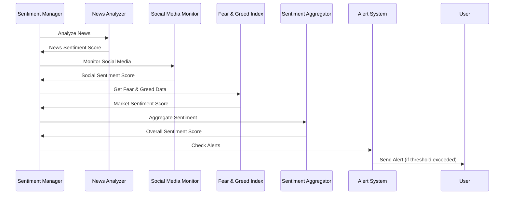

# Módulo de Sentimento de Mercado - BotCriptoFy2

## 📊 Visão Geral

O **Módulo de Sentimento de Mercado** é responsável por analisar e processar dados de sentimento do mercado de criptomoedas, incluindo notícias, redes sociais, indicadores de medo e ganância, e outros fatores que influenciam o comportamento dos traders.

## 🎯 Objetivos

- **Análise de Sentimento**: Processar dados de múltiplas fontes para determinar sentimento do mercado
- **Indicadores em Tempo Real**: Fornecer indicadores de sentimento atualizados
- **Alertas Inteligentes**: Alertas baseados em mudanças significativas de sentimento
- **Integração com Trading**: Usar sentimento para melhorar estratégias de trading
- **Análise de Notícias**: Processar e analisar notícias relevantes
- **Monitoramento Social**: Monitorar redes sociais e fóruns de cripto

## 🏗️ Arquitetura do Módulo

### **Componentes Principais**

```mermaid
graph TB
    A[Sentiment Manager] --> B[News Analyzer]
    A --> C[Social Media Monitor]
    A --> D[Fear & Greed Index]
    A --> E[Market Indicators]
    A --> F[Sentiment Aggregator]
    A --> G[Alert System]
    
    B --> H[News APIs]
    B --> I[NLP Processing]
    B --> J[Sentiment Scoring]
    
    C --> K[Twitter API]
    C --> L[Reddit API]
    C --> M[Telegram Channels]
    C --> N[Discord Servers]
    
    D --> O[Fear & Greed API]
    D --> P[Historical Data]
    D --> Q[Trend Analysis]
    
    E --> R[RSI]
    E --> S[MACD]
    E --> T[Bollinger Bands]
    E --> U[Volume Analysis]
    
    F --> V[Weighted Scoring]
    F --> W[Time Decay]
    F --> X[Source Reliability]
    
    G --> Y[Threshold Monitoring]
    G --> Z[Notification Engine]
    G --> AA[Alert History]
```



### **Fluxo de Dados**



## 📊 Estrutura de Dados

### **1. Tabela de Fontes de Sentimento**

```sql
CREATE TABLE sentiment_sources (
    id UUID PRIMARY KEY DEFAULT gen_random_uuid(),
    name VARCHAR(100) NOT NULL UNIQUE,
    type VARCHAR(50) NOT NULL, -- news, social, technical, fear_greed
    api_endpoint VARCHAR(255),
    api_key_encrypted TEXT,
    weight DECIMAL(3,2) DEFAULT 1.0, -- Peso na agregação
    reliability_score DECIMAL(3,2) DEFAULT 0.5, -- Confiabilidade da fonte
    update_frequency INTEGER DEFAULT 300, -- Segundos entre atualizações
    status VARCHAR(20) DEFAULT 'active', -- active, inactive, error
    last_update TIMESTAMP,
    created_at TIMESTAMP DEFAULT NOW(),
    updated_at TIMESTAMP DEFAULT NOW()
);

-- Índices
CREATE INDEX idx_sentiment_sources_type ON sentiment_sources(type);
CREATE INDEX idx_sentiment_sources_status ON sentiment_sources(status);
CREATE INDEX idx_sentiment_sources_last_update ON sentiment_sources(last_update);
```

### **2. Tabela de Dados de Sentimento**

```sql
CREATE TABLE sentiment_data (
    id UUID PRIMARY KEY DEFAULT gen_random_uuid(),
    source_id UUID NOT NULL REFERENCES sentiment_sources(id),
    symbol VARCHAR(20) NOT NULL,
    sentiment_score DECIMAL(5,4) NOT NULL, -- -1.0 a 1.0
    confidence_score DECIMAL(3,2) NOT NULL, -- 0.0 a 1.0
    raw_data JSONB NOT NULL,
    processed_data JSONB,
    metadata JSONB,
    timestamp TIMESTAMP NOT NULL,
    created_at TIMESTAMP DEFAULT NOW()
);

-- Índices
CREATE INDEX idx_sentiment_data_source ON sentiment_data(source_id);
CREATE INDEX idx_sentiment_data_symbol ON sentiment_data(symbol);
CREATE INDEX idx_sentiment_data_timestamp ON sentiment_data(timestamp);
CREATE INDEX idx_sentiment_data_score ON sentiment_data(sentiment_score);
CREATE INDEX idx_sentiment_data_symbol_timestamp ON sentiment_data(symbol, timestamp);
```

### **3. Tabela de Agregação de Sentimento**

```sql
CREATE TABLE sentiment_aggregates (
    id UUID PRIMARY KEY DEFAULT gen_random_uuid(),
    symbol VARCHAR(20) NOT NULL,
    timeframe VARCHAR(10) NOT NULL, -- 1m, 5m, 15m, 1h, 4h, 1d
    overall_sentiment DECIMAL(5,4) NOT NULL,
    news_sentiment DECIMAL(5,4),
    social_sentiment DECIMAL(5,4),
    technical_sentiment DECIMAL(5,4),
    fear_greed_sentiment DECIMAL(5,4),
    volume_weighted_sentiment DECIMAL(5,4),
    confidence_level DECIMAL(3,2) NOT NULL,
    source_count INTEGER NOT NULL,
    trend_direction VARCHAR(10), -- bullish, bearish, neutral
    trend_strength DECIMAL(3,2),
    timestamp TIMESTAMP NOT NULL,
    created_at TIMESTAMP DEFAULT NOW()
);

-- Índices
CREATE INDEX idx_sentiment_aggregates_symbol ON sentiment_aggregates(symbol);
CREATE INDEX idx_sentiment_aggregates_timeframe ON sentiment_aggregates(timeframe);
CREATE INDEX idx_sentiment_aggregates_timestamp ON sentiment_aggregates(timestamp);
CREATE INDEX idx_sentiment_aggregates_symbol_timeframe ON sentiment_aggregates(symbol, timeframe);
CREATE INDEX idx_sentiment_aggregates_sentiment ON sentiment_aggregates(overall_sentiment);
```

### **4. Tabela de Notícias**

```sql
CREATE TABLE sentiment_news (
    id UUID PRIMARY KEY DEFAULT gen_random_uuid(),
    source_id UUID NOT NULL REFERENCES sentiment_sources(id),
    title TEXT NOT NULL,
    content TEXT,
    url VARCHAR(500),
    author VARCHAR(100),
    published_at TIMESTAMP NOT NULL,
    sentiment_score DECIMAL(5,4) NOT NULL,
    confidence_score DECIMAL(3,2) NOT NULL,
    keywords JSONB,
    entities JSONB,
    categories JSONB,
    language VARCHAR(10) DEFAULT 'en',
    relevance_score DECIMAL(3,2),
    impact_score DECIMAL(3,2),
    created_at TIMESTAMP DEFAULT NOW()
);

-- Índices
CREATE INDEX idx_sentiment_news_source ON sentiment_news(source_id);
CREATE INDEX idx_sentiment_news_published ON sentiment_news(published_at);
CREATE INDEX idx_sentiment_news_sentiment ON sentiment_news(sentiment_score);
CREATE INDEX idx_sentiment_news_relevance ON sentiment_news(relevance_score);
CREATE INDEX idx_sentiment_news_impact ON sentiment_news(impact_score);
```

### **5. Tabela de Posts de Redes Sociais**

```sql
CREATE TABLE sentiment_social_posts (
    id UUID PRIMARY KEY DEFAULT gen_random_uuid(),
    source_id UUID NOT NULL REFERENCES sentiment_sources(id),
    platform VARCHAR(50) NOT NULL, -- twitter, reddit, telegram, discord
    post_id VARCHAR(255) NOT NULL,
    author_id VARCHAR(255),
    author_name VARCHAR(100),
    content TEXT NOT NULL,
    sentiment_score DECIMAL(5,4) NOT NULL,
    confidence_score DECIMAL(3,2) NOT NULL,
    engagement_metrics JSONB, -- likes, retweets, comments, etc.
    hashtags JSONB,
    mentions JSONB,
    symbols JSONB,
    language VARCHAR(10) DEFAULT 'en',
    published_at TIMESTAMP NOT NULL,
    created_at TIMESTAMP DEFAULT NOW(),
    UNIQUE(platform, post_id)
);

-- Índices
CREATE INDEX idx_sentiment_social_source ON sentiment_social_posts(source_id);
CREATE INDEX idx_sentiment_social_platform ON sentiment_social_posts(platform);
CREATE INDEX idx_sentiment_social_published ON sentiment_social_posts(published_at);
CREATE INDEX idx_sentiment_social_sentiment ON sentiment_social_posts(sentiment_score);
CREATE INDEX idx_sentiment_social_author ON sentiment_social_posts(author_id);
```

### **6. Tabela de Alertas de Sentimento**

```sql
CREATE TABLE sentiment_alerts (
    id UUID PRIMARY KEY DEFAULT gen_random_uuid(),
    user_id UUID NOT NULL REFERENCES users(id),
    symbol VARCHAR(20) NOT NULL,
    alert_type VARCHAR(50) NOT NULL, -- sentiment_change, extreme_sentiment, news_alert
    threshold_value DECIMAL(5,4) NOT NULL,
    current_value DECIMAL(5,4) NOT NULL,
    condition VARCHAR(20) NOT NULL, -- greater_than, less_than, equals
    status VARCHAR(20) DEFAULT 'active', -- active, triggered, disabled
    triggered_at TIMESTAMP,
    message TEXT,
    metadata JSONB,
    created_at TIMESTAMP DEFAULT NOW(),
    updated_at TIMESTAMP DEFAULT NOW()
);

-- Índices
CREATE INDEX idx_sentiment_alerts_user ON sentiment_alerts(user_id);
CREATE INDEX idx_sentiment_alerts_symbol ON sentiment_alerts(symbol);
CREATE INDEX idx_sentiment_alerts_type ON sentiment_alerts(alert_type);
CREATE INDEX idx_sentiment_alerts_status ON sentiment_alerts(status);
CREATE INDEX idx_sentiment_alerts_triggered ON sentiment_alerts(triggered_at);
```

## 🔧 Implementação dos Serviços

### **1. Sentiment Manager Service**

```typescript
// backend/src/trading/sentiment/sentiment-manager.service.ts
import { Database } from 'drizzle-orm';
import { Redis } from 'ioredis';
import { NewsAnalyzerService } from './services/news-analyzer.service';
import { SocialMediaMonitorService } from './services/social-media-monitor.service';
import { FearGreedIndexService } from './services/fear-greed-index.service';
import { TechnicalIndicatorsService } from './services/technical-indicators.service';
import { SentimentAggregatorService } from './services/sentiment-aggregator.service';
import { AlertService } from './services/alert.service';
import { AuditService } from '../audit/audit.service';

export class SentimentManagerService {
  constructor(
    private db: Database,
    private redis: Redis,
    private newsAnalyzer: NewsAnalyzerService,
    private socialMediaMonitor: SocialMediaMonitorService,
    private fearGreedIndex: FearGreedIndexService,
    private technicalIndicators: TechnicalIndicatorsService,
    private sentimentAggregator: SentimentAggregatorService,
    private alertService: AlertService,
    private auditService: AuditService
  ) {}

  // Inicializar monitoramento de sentimento
  async initializeSentimentMonitoring(): Promise<void> {
    try {
      // Inicializar todas as fontes de sentimento
      await Promise.all([
        this.newsAnalyzer.initialize(),
        this.socialMediaMonitor.initialize(),
        this.fearGreedIndex.initialize(),
        this.technicalIndicators.initialize()
      ]);

      // Iniciar loops de processamento
      this.startSentimentProcessingLoop();
      this.startAlertMonitoringLoop();

      console.log('Monitoramento de sentimento inicializado com sucesso');
    } catch (error) {
      console.error('Erro ao inicializar monitoramento de sentimento:', error);
      throw error;
    }
  }

  // Processar sentimento para um símbolo específico
  async processSentimentForSymbol(symbol: string): Promise<SentimentAggregate> {
    try {
      // Obter dados de todas as fontes
      const newsSentiment = await this.newsAnalyzer.getSentimentForSymbol(symbol);
      const socialSentiment = await this.socialMediaMonitor.getSentimentForSymbol(symbol);
      const fearGreedSentiment = await this.fearGreedIndex.getCurrentSentiment();
      const technicalSentiment = await this.technicalIndicators.getSentimentForSymbol(symbol);

      // Agregar sentimento
      const aggregate = await this.sentimentAggregator.aggregateSentiment({
        symbol,
        newsSentiment,
        socialSentiment,
        fearGreedSentiment,
        technicalSentiment
      });

      // Salvar agregação
      await this.saveSentimentAggregate(aggregate);

      // Verificar alertas
      await this.checkSentimentAlerts(symbol, aggregate);

      return aggregate;
    } catch (error) {
      console.error(`Erro ao processar sentimento para ${symbol}:`, error);
      throw error;
    }
  }

  // Obter sentimento atual
  async getCurrentSentiment(
    symbol: string,
    timeframe: string = '1h'
  ): Promise<SentimentAggregate | null> {
    try {
      const aggregate = await this.db.select()
        .from(sentimentAggregates)
        .where(
          and(
            eq(sentimentAggregates.symbol, symbol),
            eq(sentimentAggregates.timeframe, timeframe)
          )
        )
        .orderBy(desc(sentimentAggregates.timestamp))
        .limit(1);

      return aggregate[0] || null;
    } catch (error) {
      console.error(`Erro ao obter sentimento atual para ${symbol}:`, error);
      throw error;
    }
  }

  // Obter histórico de sentimento
  async getSentimentHistory(
    symbol: string,
    timeframe: string,
    startDate: Date,
    endDate: Date,
    limit: number = 100
  ): Promise<SentimentAggregate[]> {
    try {
      const history = await this.db.select()
        .from(sentimentAggregates)
        .where(
          and(
            eq(sentimentAggregates.symbol, symbol),
            eq(sentimentAggregates.timeframe, timeframe),
            gte(sentimentAggregates.timestamp, startDate),
            lte(sentimentAggregates.timestamp, endDate)
          )
        )
        .orderBy(desc(sentimentAggregates.timestamp))
        .limit(limit);

      return history;
    } catch (error) {
      console.error(`Erro ao obter histórico de sentimento para ${symbol}:`, error);
      throw error;
    }
  }

  // Criar alerta de sentimento
  async createSentimentAlert(
    userId: string,
    alertData: CreateSentimentAlertRequest
  ): Promise<SentimentAlert> {
    try {
      const alert = await this.db.insert(sentimentAlerts).values({
        userId,
        symbol: alertData.symbol,
        alertType: alertData.alertType,
        thresholdValue: alertData.thresholdValue,
        currentValue: 0, // Será atualizado quando processado
        condition: alertData.condition,
        status: 'active',
        message: alertData.message,
        metadata: alertData.metadata
      }).returning();

      // Log de auditoria
      await this.auditService.logAction(userId, 'sentiment_alert_created', {
        alertId: alert[0].id,
        symbol: alertData.symbol,
        alertType: alertData.alertType
      });

      return alert[0];
    } catch (error) {
      await this.auditService.logAction(userId, 'sentiment_alert_error', {
        error: error.message
      });
      throw error;
    }
  }

  // Obter alertas do usuário
  async getUserSentimentAlerts(userId: string): Promise<SentimentAlert[]> {
    try {
      const alerts = await this.db.select()
        .from(sentimentAlerts)
        .where(eq(sentimentAlerts.userId, userId))
        .orderBy(desc(sentimentAlerts.createdAt));

      return alerts;
    } catch (error) {
      console.error(`Erro ao obter alertas de sentimento para usuário ${userId}:`, error);
      throw error;
    }
  }

  // Obter notícias relevantes
  async getRelevantNews(
    symbol: string,
    limit: number = 20,
    hours: number = 24
  ): Promise<SentimentNews[]> {
    try {
      const cutoffTime = new Date(Date.now() - hours * 60 * 60 * 1000);
      
      const news = await this.db.select()
        .from(sentimentNews)
        .where(
          and(
            gte(sentimentNews.publishedAt, cutoffTime),
            or(
              contains(sentimentNews.keywords, [symbol]),
              contains(sentimentNews.entities, [symbol])
            )
          )
        )
        .orderBy(desc(sentimentNews.relevanceScore))
        .limit(limit);

      return news;
    } catch (error) {
      console.error(`Erro ao obter notícias relevantes para ${symbol}:`, error);
      throw error;
    }
  }

  // Obter posts de redes sociais
  async getSocialMediaPosts(
    symbol: string,
    platform?: string,
    limit: number = 50,
    hours: number = 24
  ): Promise<SentimentSocialPost[]> {
    try {
      const cutoffTime = new Date(Date.now() - hours * 60 * 60 * 1000);
      
      let whereCondition = and(
        gte(sentimentSocialPosts.publishedAt, cutoffTime),
        contains(sentimentSocialPosts.symbols, [symbol])
      );

      if (platform) {
        whereCondition = and(whereCondition, eq(sentimentSocialPosts.platform, platform));
      }

      const posts = await this.db.select()
        .from(sentimentSocialPosts)
        .where(whereCondition)
        .orderBy(desc(sentimentSocialPosts.publishedAt))
        .limit(limit);

      return posts;
    } catch (error) {
      console.error(`Erro ao obter posts de redes sociais para ${symbol}:`, error);
      throw error;
    }
  }

  // Loop de processamento de sentimento
  private startSentimentProcessingLoop(): void {
    setInterval(async () => {
      try {
        // Obter símbolos ativos
        const activeSymbols = await this.getActiveSymbols();
        
        // Processar sentimento para cada símbolo
        for (const symbol of activeSymbols) {
          await this.processSentimentForSymbol(symbol);
        }
      } catch (error) {
        console.error('Erro no loop de processamento de sentimento:', error);
      }
    }, 60000); // A cada minuto
  }

  // Loop de monitoramento de alertas
  private startAlertMonitoringLoop(): void {
    setInterval(async () => {
      try {
        // Obter alertas ativos
        const activeAlerts = await this.getActiveAlerts();
        
        // Verificar cada alerta
        for (const alert of activeAlerts) {
          await this.checkAlert(alert);
        }
      } catch (error) {
        console.error('Erro no loop de monitoramento de alertas:', error);
      }
    }, 30000); // A cada 30 segundos
  }

  // Salvar agregação de sentimento
  private async saveSentimentAggregate(aggregate: SentimentAggregate): Promise<void> {
    await this.db.insert(sentimentAggregates).values(aggregate);
  }

  // Verificar alertas de sentimento
  private async checkSentimentAlerts(symbol: string, aggregate: SentimentAggregate): Promise<void> {
    const alerts = await this.getActiveAlertsForSymbol(symbol);
    
    for (const alert of alerts) {
      const shouldTrigger = this.evaluateAlertCondition(alert, aggregate.overallSentiment);
      
      if (shouldTrigger) {
        await this.triggerAlert(alert, aggregate);
      }
    }
  }

  // Obter símbolos ativos
  private async getActiveSymbols(): Promise<string[]> {
    // Implementar lógica para obter símbolos ativos
    return ['BTC', 'ETH', 'BNB', 'ADA', 'SOL'];
  }

  // Obter alertas ativos
  private async getActiveAlerts(): Promise<SentimentAlert[]> {
    const alerts = await this.db.select()
      .from(sentimentAlerts)
      .where(eq(sentimentAlerts.status, 'active'));

    return alerts;
  }

  // Obter alertas ativos para símbolo
  private async getActiveAlertsForSymbol(symbol: string): Promise<SentimentAlert[]> {
    const alerts = await this.db.select()
      .from(sentimentAlerts)
      .where(
        and(
          eq(sentimentAlerts.symbol, symbol),
          eq(sentimentAlerts.status, 'active')
        )
      );

    return alerts;
  }

  // Avaliar condição do alerta
  private evaluateAlertCondition(alert: SentimentAlert, currentValue: number): boolean {
    switch (alert.condition) {
      case 'greater_than':
        return currentValue > alert.thresholdValue;
      case 'less_than':
        return currentValue < alert.thresholdValue;
      case 'equals':
        return Math.abs(currentValue - alert.thresholdValue) < 0.01;
      default:
        return false;
    }
  }

  // Disparar alerta
  private async triggerAlert(alert: SentimentAlert, aggregate: SentimentAggregate): Promise<void> {
    try {
      // Atualizar status do alerta
      await this.db.update(sentimentAlerts)
        .set({
          status: 'triggered',
          triggeredAt: new Date(),
          currentValue: aggregate.overallSentiment
        })
        .where(eq(sentimentAlerts.id, alert.id));

      // Enviar notificação
      await this.alertService.sendSentimentAlert(alert, aggregate);

      // Log de auditoria
      await this.auditService.logAction(alert.userId, 'sentiment_alert_triggered', {
        alertId: alert.id,
        symbol: alert.symbol,
        currentValue: aggregate.overallSentiment,
        thresholdValue: alert.thresholdValue
      });
    } catch (error) {
      console.error(`Erro ao disparar alerta ${alert.id}:`, error);
    }
  }
}
```

### **2. News Analyzer Service**

```typescript
// backend/src/trading/sentiment/services/news-analyzer.service.ts
import { Database } from 'drizzle-orm';
import { Redis } from 'ioredis';
import { NewsAPI } from './integrations/news-api';
import { NLPProcessor } from './processors/nlp.processor';
import { SentimentAnalyzer } from './analyzers/sentiment.analyzer';

export class NewsAnalyzerService {
  constructor(
    private db: Database,
    private redis: Redis,
    private newsAPI: NewsAPI,
    private nlpProcessor: NLPProcessor,
    private sentimentAnalyzer: SentimentAnalyzer
  ) {}

  async initialize(): Promise<void> {
    // Inicializar APIs de notícias
    await this.newsAPI.initialize();
    
    // Iniciar loop de processamento
    this.startNewsProcessingLoop();
  }

  async getSentimentForSymbol(symbol: string): Promise<SentimentData> {
    try {
      // Obter notícias recentes
      const news = await this.newsAPI.getNewsForSymbol(symbol);
      
      // Processar cada notícia
      const processedNews = await Promise.all(
        news.map(article => this.processNewsArticle(article, symbol))
      );

      // Calcular sentimento agregado
      const aggregateSentiment = this.calculateAggregateSentiment(processedNews);

      return {
        sourceId: 'news-api',
        symbol,
        sentimentScore: aggregateSentiment.score,
        confidenceScore: aggregateSentiment.confidence,
        rawData: news,
        processedData: processedNews,
        timestamp: new Date()
      };
    } catch (error) {
      console.error(`Erro ao analisar sentimento de notícias para ${symbol}:`, error);
      throw error;
    }
  }

  private async processNewsArticle(article: NewsArticle, symbol: string): Promise<ProcessedNews> {
    try {
      // Processar texto com NLP
      const nlpResult = await this.nlpProcessor.process(article.content);
      
      // Analisar sentimento
      const sentiment = await this.sentimentAnalyzer.analyze(article.content);
      
      // Extrair entidades e palavras-chave
      const entities = nlpResult.entities;
      const keywords = nlpResult.keywords;
      
      // Calcular relevância
      const relevance = this.calculateRelevance(article, symbol, keywords);
      
      // Calcular impacto
      const impact = this.calculateImpact(article, sentiment.score);

      // Salvar notícia processada
      const savedNews = await this.db.insert(sentimentNews).values({
        sourceId: 'news-api',
        title: article.title,
        content: article.content,
        url: article.url,
        author: article.author,
        publishedAt: article.publishedAt,
        sentimentScore: sentiment.score,
        confidenceScore: sentiment.confidence,
        keywords: keywords,
        entities: entities,
        categories: nlpResult.categories,
        language: article.language,
        relevanceScore: relevance,
        impactScore: impact
      }).returning();

      return {
        id: savedNews[0].id,
        article,
        sentiment,
        nlpResult,
        relevance,
        impact
      };
    } catch (error) {
      console.error(`Erro ao processar artigo de notícia:`, error);
      throw error;
    }
  }

  private calculateAggregateSentiment(processedNews: ProcessedNews[]): {
    score: number;
    confidence: number;
  } {
    if (processedNews.length === 0) {
      return { score: 0, confidence: 0 };
    }

    // Calcular média ponderada por relevância e impacto
    let totalWeight = 0;
    let weightedScore = 0;
    let totalConfidence = 0;

    for (const news of processedNews) {
      const weight = news.relevance * news.impact;
      weightedScore += news.sentiment.score * weight;
      totalWeight += weight;
      totalConfidence += news.sentiment.confidence;
    }

    return {
      score: totalWeight > 0 ? weightedScore / totalWeight : 0,
      confidence: totalConfidence / processedNews.length
    };
  }

  private calculateRelevance(article: NewsArticle, symbol: string, keywords: string[]): number {
    let relevance = 0;
    
    // Verificar se o símbolo está no título ou conteúdo
    if (article.title.toLowerCase().includes(symbol.toLowerCase())) {
      relevance += 0.5;
    }
    if (article.content.toLowerCase().includes(symbol.toLowerCase())) {
      relevance += 0.3;
    }
    
    // Verificar palavras-chave relacionadas
    const cryptoKeywords = ['bitcoin', 'ethereum', 'crypto', 'cryptocurrency', 'blockchain', 'trading'];
    const matchingKeywords = keywords.filter(keyword => 
      cryptoKeywords.some(crypto => keyword.toLowerCase().includes(crypto))
    );
    relevance += matchingKeywords.length * 0.1;
    
    return Math.min(relevance, 1.0);
  }

  private calculateImpact(article: NewsArticle, sentimentScore: number): number {
    let impact = 0;
    
    // Fator de sentimento (mais extremo = mais impacto)
    impact += Math.abs(sentimentScore) * 0.4;
    
    // Fator de fonte (fontes mais confiáveis = mais impacto)
    const sourceImpact = this.getSourceImpact(article.source);
    impact += sourceImpact * 0.3;
    
    // Fator de tempo (notícias mais recentes = mais impacto)
    const hoursAgo = (Date.now() - article.publishedAt.getTime()) / (1000 * 60 * 60);
    const timeFactor = Math.max(0, 1 - (hoursAgo / 24)); // Decai ao longo de 24 horas
    impact += timeFactor * 0.3;
    
    return Math.min(impact, 1.0);
  }

  private getSourceImpact(source: string): number {
    const sourceImpacts: Record<string, number> = {
      'reuters': 0.9,
      'bloomberg': 0.9,
      'coindesk': 0.8,
      'cointelegraph': 0.8,
      'decrypt': 0.7,
      'theblock': 0.7,
      'cryptonews': 0.6,
      'bitcoinist': 0.6,
      'newsbtc': 0.5
    };
    
    return sourceImpacts[source.toLowerCase()] || 0.3;
  }

  private startNewsProcessingLoop(): void {
    setInterval(async () => {
      try {
        // Obter símbolos ativos
        const activeSymbols = await this.getActiveSymbols();
        
        // Processar notícias para cada símbolo
        for (const symbol of activeSymbols) {
          await this.getSentimentForSymbol(symbol);
        }
      } catch (error) {
        console.error('Erro no loop de processamento de notícias:', error);
      }
    }, 300000); // A cada 5 minutos
  }

  private async getActiveSymbols(): Promise<string[]> {
    // Implementar lógica para obter símbolos ativos
    return ['BTC', 'ETH', 'BNB', 'ADA', 'SOL'];
  }
}
```

### **3. Social Media Monitor Service**

```typescript
// backend/src/trading/sentiment/services/social-media-monitor.service.ts
import { Database } from 'drizzle-orm';
import { Redis } from 'ioredis';
import { TwitterAPI } from './integrations/twitter-api';
import { RedditAPI } from './integrations/reddit-api';
import { TelegramAPI } from './integrations/telegram-api';
import { DiscordAPI } from './integrations/discord-api';
import { SentimentAnalyzer } from './analyzers/sentiment.analyzer';

export class SocialMediaMonitorService {
  constructor(
    private db: Database,
    private redis: Redis,
    private twitterAPI: TwitterAPI,
    private redditAPI: RedditAPI,
    private telegramAPI: TelegramAPI,
    private discordAPI: DiscordAPI,
    private sentimentAnalyzer: SentimentAnalyzer
  ) {}

  async initialize(): Promise<void> {
    // Inicializar APIs de redes sociais
    await Promise.all([
      this.twitterAPI.initialize(),
      this.redditAPI.initialize(),
      this.telegramAPI.initialize(),
      this.discordAPI.initialize()
    ]);
    
    // Iniciar loops de monitoramento
    this.startSocialMediaMonitoringLoops();
  }

  async getSentimentForSymbol(symbol: string): Promise<SentimentData> {
    try {
      // Obter posts de todas as plataformas
      const [twitterPosts, redditPosts, telegramPosts, discordPosts] = await Promise.all([
        this.twitterAPI.getPostsForSymbol(symbol),
        this.redditAPI.getPostsForSymbol(symbol),
        this.telegramAPI.getPostsForSymbol(symbol),
        this.discordAPI.getPostsForSymbol(symbol)
      ]);

      // Processar todos os posts
      const allPosts = [
        ...twitterPosts.map(post => ({ ...post, platform: 'twitter' })),
        ...redditPosts.map(post => ({ ...post, platform: 'reddit' })),
        ...telegramPosts.map(post => ({ ...post, platform: 'telegram' })),
        ...discordPosts.map(post => ({ ...post, platform: 'discord' }))
      ];

      const processedPosts = await Promise.all(
        allPosts.map(post => this.processSocialPost(post, symbol))
      );

      // Calcular sentimento agregado
      const aggregateSentiment = this.calculateAggregateSentiment(processedPosts);

      return {
        sourceId: 'social-media',
        symbol,
        sentimentScore: aggregateSentiment.score,
        confidenceScore: aggregateSentiment.confidence,
        rawData: allPosts,
        processedData: processedPosts,
        timestamp: new Date()
      };
    } catch (error) {
      console.error(`Erro ao analisar sentimento de redes sociais para ${symbol}:`, error);
      throw error;
    }
  }

  private async processSocialPost(post: SocialPost, symbol: string): Promise<ProcessedSocialPost> {
    try {
      // Analisar sentimento
      const sentiment = await this.sentimentAnalyzer.analyze(post.content);
      
      // Extrair hashtags e menções
      const hashtags = this.extractHashtags(post.content);
      const mentions = this.extractMentions(post.content);
      const symbols = this.extractSymbols(post.content);
      
      // Calcular métricas de engajamento
      const engagementMetrics = this.calculateEngagementMetrics(post);
      
      // Calcular peso do post
      const weight = this.calculatePostWeight(post, sentiment, engagementMetrics);

      // Salvar post processado
      const savedPost = await this.db.insert(sentimentSocialPosts).values({
        sourceId: 'social-media',
        platform: post.platform,
        postId: post.id,
        authorId: post.authorId,
        authorName: post.authorName,
        content: post.content,
        sentimentScore: sentiment.score,
        confidenceScore: sentiment.confidence,
        engagementMetrics: engagementMetrics,
        hashtags: hashtags,
        mentions: mentions,
        symbols: symbols,
        language: post.language,
        publishedAt: post.publishedAt
      }).returning();

      return {
        id: savedPost[0].id,
        post,
        sentiment,
        engagementMetrics,
        weight
      };
    } catch (error) {
      console.error(`Erro ao processar post de rede social:`, error);
      throw error;
    }
  }

  private calculateAggregateSentiment(processedPosts: ProcessedSocialPost[]): {
    score: number;
    confidence: number;
  } {
    if (processedPosts.length === 0) {
      return { score: 0, confidence: 0 };
    }

    // Calcular média ponderada por peso do post
    let totalWeight = 0;
    let weightedScore = 0;
    let totalConfidence = 0;

    for (const post of processedPosts) {
      weightedScore += post.sentiment.score * post.weight;
      totalWeight += post.weight;
      totalConfidence += post.sentiment.confidence;
    }

    return {
      score: totalWeight > 0 ? weightedScore / totalWeight : 0,
      confidence: totalConfidence / processedPosts.length
    };
  }

  private extractHashtags(content: string): string[] {
    const hashtagRegex = /#\w+/g;
    return content.match(hashtagRegex) || [];
  }

  private extractMentions(content: string): string[] {
    const mentionRegex = /@\w+/g;
    return content.match(mentionRegex) || [];
  }

  private extractSymbols(content: string): string[] {
    const symbolRegex = /\$[A-Z]{2,10}/g;
    return content.match(symbolRegex) || [];
  }

  private calculateEngagementMetrics(post: SocialPost): EngagementMetrics {
    return {
      likes: post.likes || 0,
      retweets: post.retweets || 0,
      comments: post.comments || 0,
      shares: post.shares || 0,
      totalEngagement: (post.likes || 0) + (post.retweets || 0) + (post.comments || 0) + (post.shares || 0)
    };
  }

  private calculatePostWeight(
    post: SocialPost,
    sentiment: SentimentResult,
    engagement: EngagementMetrics
  ): number {
    let weight = 0;
    
    // Fator de sentimento (mais extremo = mais peso)
    weight += Math.abs(sentiment.score) * 0.3;
    
    // Fator de engajamento
    const engagementFactor = Math.log(engagement.totalEngagement + 1) / 10;
    weight += Math.min(engagementFactor, 1.0) * 0.4;
    
    // Fator de plataforma
    const platformWeight = this.getPlatformWeight(post.platform);
    weight += platformWeight * 0.3;
    
    return Math.min(weight, 1.0);
  }

  private getPlatformWeight(platform: string): number {
    const platformWeights: Record<string, number> = {
      'twitter': 0.8,
      'reddit': 0.7,
      'telegram': 0.6,
      'discord': 0.5
    };
    
    return platformWeights[platform] || 0.3;
  }

  private startSocialMediaMonitoringLoops(): void {
    // Loop para Twitter
    setInterval(async () => {
      try {
        await this.monitorTwitter();
      } catch (error) {
        console.error('Erro no monitoramento do Twitter:', error);
      }
    }, 60000); // A cada minuto

    // Loop para Reddit
    setInterval(async () => {
      try {
        await this.monitorReddit();
      } catch (error) {
        console.error('Erro no monitoramento do Reddit:', error);
      }
    }, 120000); // A cada 2 minutos

    // Loop para Telegram
    setInterval(async () => {
      try {
        await this.monitorTelegram();
      } catch (error) {
        console.error('Erro no monitoramento do Telegram:', error);
      }
    }, 300000); // A cada 5 minutos

    // Loop para Discord
    setInterval(async () => {
      try {
        await this.monitorDiscord();
      } catch (error) {
        console.error('Erro no monitoramento do Discord:', error);
      }
    }, 300000); // A cada 5 minutos
  }

  private async monitorTwitter(): Promise<void> {
    // Implementar monitoramento do Twitter
  }

  private async monitorReddit(): Promise<void> {
    // Implementar monitoramento do Reddit
  }

  private async monitorTelegram(): Promise<void> {
    // Implementar monitoramento do Telegram
  }

  private async monitorDiscord(): Promise<void> {
    // Implementar monitoramento do Discord
  }
}
```

## 🔌 API Endpoints

### **1. Sentimento de Mercado**

```typescript
// GET /api/sentiment/current
app.get('/api/sentiment/current', async (c) => {
  const { symbol, timeframe } = c.req.query();
  
  const sentiment = await sentimentManagerService.getCurrentSentiment(
    symbol || 'BTC',
    timeframe || '1h'
  );
  
  return c.json({ success: true, data: sentiment });
});

// GET /api/sentiment/history
app.get('/api/sentiment/history', async (c) => {
  const { symbol, timeframe, startDate, endDate, limit } = c.req.query();
  
  const history = await sentimentManagerService.getSentimentHistory(
    symbol || 'BTC',
    timeframe || '1h',
    new Date(startDate),
    new Date(endDate),
    parseInt(limit) || 100
  );
  
  return c.json({ success: true, data: history });
});

// POST /api/sentiment/process
app.post('/api/sentiment/process', async (c) => {
  const { symbol } = await c.req.json();
  
  const sentiment = await sentimentManagerService.processSentimentForSymbol(symbol);
  
  return c.json({ success: true, data: sentiment });
});
```

### **2. Alertas de Sentimento**

```typescript
// POST /api/sentiment/alerts
app.post('/api/sentiment/alerts', async (c) => {
  const alertData = await c.req.json();
  const userId = c.get('userId');
  
  const alert = await sentimentManagerService.createSentimentAlert(userId, alertData);
  
  return c.json({ success: true, data: alert });
});

// GET /api/sentiment/alerts
app.get('/api/sentiment/alerts', async (c) => {
  const userId = c.get('userId');
  
  const alerts = await sentimentManagerService.getUserSentimentAlerts(userId);
  
  return c.json({ success: true, data: alerts });
});

// PUT /api/sentiment/alerts/:id
app.put('/api/sentiment/alerts/:id', async (c) => {
  const { id } = c.req.param();
  const updates = await c.req.json();
  const userId = c.get('userId');
  
  const alert = await sentimentManagerService.updateSentimentAlert(userId, id, updates);
  
  return c.json({ success: true, data: alert });
});

// DELETE /api/sentiment/alerts/:id
app.delete('/api/sentiment/alerts/:id', async (c) => {
  const { id } = c.req.param();
  const userId = c.get('userId');
  
  await sentimentManagerService.deleteSentimentAlert(userId, id);
  
  return c.json({ success: true, message: 'Alerta removido com sucesso' });
});
```

### **3. Notícias e Redes Sociais**

```typescript
// GET /api/sentiment/news
app.get('/api/sentiment/news', async (c) => {
  const { symbol, limit, hours } = c.req.query();
  
  const news = await sentimentManagerService.getRelevantNews(
    symbol || 'BTC',
    parseInt(limit) || 20,
    parseInt(hours) || 24
  );
  
  return c.json({ success: true, data: news });
});

// GET /api/sentiment/social
app.get('/api/sentiment/social', async (c) => {
  const { symbol, platform, limit, hours } = c.req.query();
  
  const posts = await sentimentManagerService.getSocialMediaPosts(
    symbol || 'BTC',
    platform,
    parseInt(limit) || 50,
    parseInt(hours) || 24
  );
  
  return c.json({ success: true, data: posts });
});
```

## 🔒 Segurança e Validação

### **1. Validação de Dados**

```typescript
// backend/src/trading/sentiment/validators/sentiment.validators.ts
import { z } from 'zod';

export const CreateSentimentAlertSchema = z.object({
  symbol: z.string().min(1).max(10),
  alertType: z.enum(['sentiment_change', 'extreme_sentiment', 'news_alert']),
  thresholdValue: z.number().min(-1).max(1),
  condition: z.enum(['greater_than', 'less_than', 'equals']),
  message: z.string().optional(),
  metadata: z.record(z.any()).optional()
});

export const SentimentQuerySchema = z.object({
  symbol: z.string().min(1).max(10),
  timeframe: z.enum(['1m', '5m', '15m', '1h', '4h', '1d']).default('1h'),
  startDate: z.string().datetime().optional(),
  endDate: z.string().datetime().optional(),
  limit: z.number().int().min(1).max(1000).default(100)
});
```

## 📊 Monitoramento e Métricas

### **1. Métricas de Sentimento**

```typescript
// backend/src/trading/sentiment/monitoring/sentiment.metrics.ts
export class SentimentMetrics {
  private static instance: SentimentMetrics;
  private prometheus: PrometheusClient;

  constructor() {
    this.prometheus = new PrometheusClient();
  }

  static getInstance(): SentimentMetrics {
    if (!SentimentMetrics.instance) {
      SentimentMetrics.instance = new SentimentMetrics();
    }
    return SentimentMetrics.instance;
  }

  // Métricas de processamento
  recordSentimentProcessed(symbol: string, source: string, processingTime: number): void {
    this.prometheus.incrementCounter('sentiment_processed_total', {
      symbol: symbol,
      source: source
    });
    this.prometheus.observeHistogram('sentiment_processing_time', processingTime, {
      symbol: symbol,
      source: source
    });
  }

  // Métricas de alertas
  recordAlertTriggered(symbol: string, alertType: string): void {
    this.prometheus.incrementCounter('sentiment_alerts_triggered_total', {
      symbol: symbol,
      alert_type: alertType
    });
  }

  // Métricas de fontes
  recordSourceUpdate(source: string, status: string, updateTime: number): void {
    this.prometheus.incrementCounter('sentiment_source_updates_total', {
      source: source,
      status: status
    });
    this.prometheus.observeHistogram('sentiment_source_update_time', updateTime, {
      source: source
    });
  }

  // Métricas de confiabilidade
  recordSourceReliability(source: string, reliability: number): void {
    this.prometheus.setGauge('sentiment_source_reliability', reliability, {
      source: source
    });
  }
}
```

## 🎯 Integração com Outros Módulos

### **1. Integração com Trading Engine**
- **Sinais de Trading**: Usar sentimento para gerar sinais de trading
- **Filtros de Estratégia**: Filtrar estratégias baseadas no sentimento
- **Gestão de Risco**: Ajustar risco baseado no sentimento do mercado

### **2. Integração com Notificações**
- **Alertas de Sentimento**: Notificar mudanças significativas de sentimento
- **Resumos Diários**: Enviar resumos de sentimento do mercado
- **Alertas de Notícias**: Notificar sobre notícias importantes

### **3. Integração com Analytics**
- **Dashboards**: Incluir métricas de sentimento nos dashboards
- **Relatórios**: Gerar relatórios de sentimento do mercado
- **Análise de Tendências**: Analisar tendências de sentimento ao longo do tempo

### **4. Integração com Banco**
- **Correlação com Preços**: Correlacionar sentimento com movimentos de preço
- **Análise de Volatilidade**: Usar sentimento para prever volatilidade
- **Gestão de Portfolio**: Ajustar portfolio baseado no sentimento

---

**Conclusão**: O Módulo de Sentimento de Mercado fornece análise abrangente do sentimento do mercado através de múltiplas fontes, permitindo decisões de trading mais informadas e alertas inteligentes baseados em mudanças de sentimento.

**Última atualização**: 2024-12-19
**Versão**: 1.0.0
**Responsável**: Agente-CTO