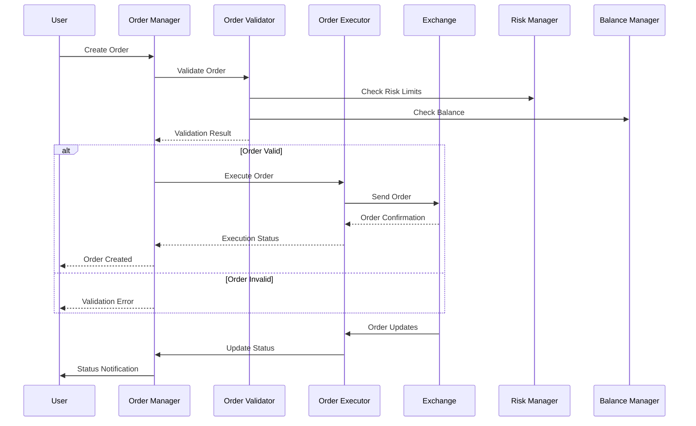

# Módulo de Ordens - BotCriptoFy2

## 📋 Visão Geral

O **Módulo de Ordens** é o núcleo central do sistema de trading, responsável por gerenciar todo o ciclo de vida das ordens, desde a criação até a execução, cancelamento e liquidação. Este módulo integra com exchanges, sistemas de risco, e fornece uma interface unificada para operações de trading.

## 🎯 Objetivos

- **Gestão Completa de Ordens**: Criar, modificar, cancelar e executar ordens
- **Integração com Exchanges**: Executar ordens em múltiplas exchanges
- **Gestão de Risco**: Validar ordens contra limites de risco
- **Execução Inteligente**: Algoritmos de execução avançados
- **Monitoramento em Tempo Real**: Acompanhar status das ordens
- **Auditoria Completa**: Rastrear todas as operações
- **Settlement Automático**: Liquidação automática de ordens executadas

## 🏗️ Arquitetura do Módulo

### **Componentes Principais**

```mermaid
graph TB
    A[Order Manager] --> B[Order Creator]
    A --> C[Order Validator]
    A --> D[Order Executor]
    A --> E[Order Monitor]
    A --> F[Order Settlement]
    A --> G[Order History]
    
    B --> H[Order Templates]
    B --> I[Order Builder]
    B --> J[Order Validation]
    
    C --> K[Risk Validation]
    C --> L[Balance Validation]
    C --> M[Market Validation]
    C --> N[Permission Validation]
    
    D --> O[Exchange Router]
    D --> P[Execution Engine]
    D --> Q[Order Matching]
    D --> R[Partial Fills]
    
    E --> S[Status Tracker]
    E --> T[Event Notifier]
    E --> U[Performance Monitor]
    
    F --> V[P&L Calculator]
    F --> W[Fee Calculator]
    F --> X[Balance Updater]
    F --> Y[Position Updater]
    
    G --> Z[Order Archive]
    G --> AA[Audit Trail]
    G --> BB[Analytics]
```



### **Fluxo de Vida da Ordem**



## 📊 Estrutura de Dados

### **1. Tabela de Ordens**

```sql
CREATE TABLE orders (
    id UUID PRIMARY KEY DEFAULT gen_random_uuid(),
    user_id UUID NOT NULL REFERENCES users(id),
    bot_id UUID REFERENCES trading_bots(id),
    strategy_id UUID REFERENCES trading_strategies(id),
    exchange_id UUID REFERENCES exchanges(id),
    exchange_order_id VARCHAR(255),
    
    -- Informações básicas da ordem
    symbol VARCHAR(50) NOT NULL,
    side VARCHAR(10) NOT NULL, -- buy, sell
    type VARCHAR(20) NOT NULL, -- market, limit, stop, stop_limit, trailing_stop
    status VARCHAR(20) DEFAULT 'pending', -- pending, submitted, filled, cancelled, rejected, expired
    
    -- Quantidades e preços
    quantity DECIMAL(20,8) NOT NULL,
    price DECIMAL(20,8),
    stop_price DECIMAL(20,8),
    limit_price DECIMAL(20,8),
    trailing_distance DECIMAL(20,8),
    
    -- Execução
    filled_quantity DECIMAL(20,8) DEFAULT 0,
    remaining_quantity DECIMAL(20,8) DEFAULT 0,
    average_price DECIMAL(20,8),
    total_cost DECIMAL(20,8) DEFAULT 0,
    
    -- Configurações
    time_in_force VARCHAR(10) DEFAULT 'GTC', -- GTC, IOC, FOK, GTD
    expire_time TIMESTAMP,
    post_only BOOLEAN DEFAULT false,
    reduce_only BOOLEAN DEFAULT false,
    
    -- Metadados
    client_order_id VARCHAR(255),
    tags JSONB DEFAULT '{}',
    metadata JSONB DEFAULT '{}',
    
    -- Timestamps
    created_at TIMESTAMP DEFAULT NOW(),
    updated_at TIMESTAMP DEFAULT NOW(),
    submitted_at TIMESTAMP,
    filled_at TIMESTAMP,
    cancelled_at TIMESTAMP,
    expired_at TIMESTAMP,
    
    -- Auditoria
    created_by VARCHAR(100),
    updated_by VARCHAR(100),
    ip_address INET,
    user_agent TEXT
);

-- Índices
CREATE INDEX idx_orders_user ON orders(user_id);
CREATE INDEX idx_orders_bot ON orders(bot_id);
CREATE INDEX idx_orders_strategy ON orders(strategy_id);
CREATE INDEX idx_orders_exchange ON orders(exchange_id);
CREATE INDEX idx_orders_symbol ON orders(symbol);
CREATE INDEX idx_orders_status ON orders(status);
CREATE INDEX idx_orders_side ON orders(side);
CREATE INDEX idx_orders_type ON orders(type);
CREATE INDEX idx_orders_created ON orders(created_at);
CREATE INDEX idx_orders_exchange_order_id ON orders(exchange_order_id);
CREATE INDEX idx_orders_client_order_id ON orders(client_order_id);
```

### **2. Tabela de Execuções (Fills)**

```sql
CREATE TABLE order_fills (
    id UUID PRIMARY KEY DEFAULT gen_random_uuid(),
    order_id UUID NOT NULL REFERENCES orders(id),
    exchange_fill_id VARCHAR(255),
    
    -- Informações da execução
    quantity DECIMAL(20,8) NOT NULL,
    price DECIMAL(20,8) NOT NULL,
    cost DECIMAL(20,8) NOT NULL,
    fee DECIMAL(20,8) DEFAULT 0,
    fee_currency VARCHAR(10),
    
    -- Metadados
    liquidity VARCHAR(10), -- maker, taker
    trade_id VARCHAR(255),
    timestamp TIMESTAMP NOT NULL,
    
    -- Auditoria
    created_at TIMESTAMP DEFAULT NOW()
);

-- Índices
CREATE INDEX idx_order_fills_order ON order_fills(order_id);
CREATE INDEX idx_order_fills_timestamp ON order_fills(timestamp);
CREATE INDEX idx_order_fills_exchange_fill_id ON order_fills(exchange_fill_id);
```

### **3. Tabela de Histórico de Status**

```sql
CREATE TABLE order_status_history (
    id UUID PRIMARY KEY DEFAULT gen_random_uuid(),
    order_id UUID NOT NULL REFERENCES orders(id),
    status VARCHAR(20) NOT NULL,
    previous_status VARCHAR(20),
    reason TEXT,
    metadata JSONB DEFAULT '{}',
    timestamp TIMESTAMP DEFAULT NOW(),
    created_by VARCHAR(100)
);

-- Índices
CREATE INDEX idx_order_status_history_order ON order_status_history(order_id);
CREATE INDEX idx_order_status_history_status ON order_status_history(status);
CREATE INDEX idx_order_status_history_timestamp ON order_status_history(timestamp);
```

### **4. Tabela de Templates de Ordem**

```sql
CREATE TABLE order_templates (
    id UUID PRIMARY KEY DEFAULT gen_random_uuid(),
    user_id UUID NOT NULL REFERENCES users(id),
    name VARCHAR(100) NOT NULL,
    description TEXT,
    
    -- Configurações do template
    symbol VARCHAR(50) NOT NULL,
    side VARCHAR(10) NOT NULL,
    type VARCHAR(20) NOT NULL,
    default_quantity DECIMAL(20,8),
    default_price DECIMAL(20,8),
    default_stop_price DECIMAL(20,8),
    default_time_in_force VARCHAR(10) DEFAULT 'GTC',
    default_post_only BOOLEAN DEFAULT false,
    default_reduce_only BOOLEAN DEFAULT false,
    
    -- Configurações avançadas
    quantity_percentage DECIMAL(5,2), -- % do saldo disponível
    price_offset DECIMAL(20,8), -- Offset do preço de mercado
    stop_loss_percentage DECIMAL(5,2), -- % para stop loss
    take_profit_percentage DECIMAL(5,2), -- % para take profit
    
    -- Metadados
    tags JSONB DEFAULT '{}',
    is_public BOOLEAN DEFAULT false,
    usage_count INTEGER DEFAULT 0,
    
    -- Timestamps
    created_at TIMESTAMP DEFAULT NOW(),
    updated_at TIMESTAMP DEFAULT NOW()
);

-- Índices
CREATE INDEX idx_order_templates_user ON order_templates(user_id);
CREATE INDEX idx_order_templates_symbol ON order_templates(symbol);
CREATE INDEX idx_order_templates_public ON order_templates(is_public);
CREATE INDEX idx_order_templates_usage ON order_templates(usage_count);
```

### **5. Tabela de Ordens Condicionais**

```sql
CREATE TABLE conditional_orders (
    id UUID PRIMARY KEY DEFAULT gen_random_uuid(),
    order_id UUID NOT NULL REFERENCES orders(id),
    condition_type VARCHAR(50) NOT NULL, -- price_above, price_below, volume_above, time_based
    condition_value DECIMAL(20,8) NOT NULL,
    condition_operator VARCHAR(10) NOT NULL, -- gt, gte, lt, lte, eq
    condition_metadata JSONB DEFAULT '{}',
    is_active BOOLEAN DEFAULT true,
    triggered_at TIMESTAMP,
    created_at TIMESTAMP DEFAULT NOW()
);

-- Índices
CREATE INDEX idx_conditional_orders_order ON conditional_orders(order_id);
CREATE INDEX idx_conditional_orders_active ON conditional_orders(is_active);
CREATE INDEX idx_conditional_orders_type ON conditional_orders(condition_type);
```

### **6. Tabela de Ordens em Lote**

```sql
CREATE TABLE order_batches (
    id UUID PRIMARY KEY DEFAULT gen_random_uuid(),
    user_id UUID NOT NULL REFERENCES users(id),
    name VARCHAR(100) NOT NULL,
    description TEXT,
    status VARCHAR(20) DEFAULT 'pending', -- pending, executing, completed, cancelled
    total_orders INTEGER NOT NULL,
    executed_orders INTEGER DEFAULT 0,
    cancelled_orders INTEGER DEFAULT 0,
    failed_orders INTEGER DEFAULT 0,
    
    -- Configurações de execução
    execution_strategy VARCHAR(50) DEFAULT 'sequential', -- sequential, parallel, staggered
    delay_between_orders INTEGER DEFAULT 0, -- ms
    max_concurrent_orders INTEGER DEFAULT 1,
    
    -- Metadados
    metadata JSONB DEFAULT '{}',
    
    -- Timestamps
    created_at TIMESTAMP DEFAULT NOW(),
    started_at TIMESTAMP,
    completed_at TIMESTAMP
);

-- Índices
CREATE INDEX idx_order_batches_user ON order_batches(user_id);
CREATE INDEX idx_order_batches_status ON order_batches(status);
CREATE INDEX idx_order_batches_created ON order_batches(created_at);
```

### **7. Tabela de Monitoramento de Ordens**

```sql
CREATE TABLE order_monitoring (
    id UUID PRIMARY KEY DEFAULT gen_random_uuid(),
    order_id UUID NOT NULL REFERENCES orders(id),
    monitoring_type VARCHAR(50) NOT NULL, -- local, exchange, websocket
    status VARCHAR(20) DEFAULT 'active', -- active, paused, stopped, error
    last_check_at TIMESTAMP,
    last_update_at TIMESTAMP,
    error_count INTEGER DEFAULT 0,
    last_error_at TIMESTAMP,
    last_error_message TEXT,
    configuration JSONB DEFAULT '{}',
    created_at TIMESTAMP DEFAULT NOW(),
    updated_at TIMESTAMP DEFAULT NOW()
);

-- Índices
CREATE INDEX idx_order_monitoring_order ON order_monitoring(order_id);
CREATE INDEX idx_order_monitoring_type ON order_monitoring(monitoring_type);
CREATE INDEX idx_order_monitoring_status ON order_monitoring(status);
CREATE INDEX idx_order_monitoring_last_check ON order_monitoring(last_check_at);
```

### **8. Tabela de Estatísticas de Execução**

```sql
CREATE TABLE order_execution_stats (
    id UUID PRIMARY KEY DEFAULT gen_random_uuid(),
    order_id UUID NOT NULL REFERENCES orders(id),
    total_fills INTEGER DEFAULT 0,
    total_quantity DECIMAL(20,8) DEFAULT 0,
    total_cost DECIMAL(20,8) DEFAULT 0,
    total_fees DECIMAL(20,8) DEFAULT 0,
    average_price DECIMAL(20,8) DEFAULT 0,
    execution_time_ms INTEGER DEFAULT 0,
    first_fill_at TIMESTAMP,
    last_fill_at TIMESTAMP,
    fill_frequency_avg DECIMAL(10,2) DEFAULT 0, -- fills por minuto
    price_improvement DECIMAL(20,8) DEFAULT 0, -- melhoria de preço vs preço limite
    slippage DECIMAL(20,8) DEFAULT 0, -- slippage vs preço de mercado
    created_at TIMESTAMP DEFAULT NOW(),
    updated_at TIMESTAMP DEFAULT NOW()
);

-- Índices
CREATE INDEX idx_order_execution_stats_order ON order_execution_stats(order_id);
CREATE INDEX idx_order_execution_stats_execution_time ON order_execution_stats(execution_time_ms);
CREATE INDEX idx_order_execution_stats_first_fill ON order_execution_stats(first_fill_at);
```

### **9. Tabela de Alertas de Execução**

```sql
CREATE TABLE order_execution_alerts (
    id UUID PRIMARY KEY DEFAULT gen_random_uuid(),
    order_id UUID NOT NULL REFERENCES orders(id),
    alert_type VARCHAR(50) NOT NULL, -- fill_received, partial_fill, large_fill, execution_delay
    threshold_value DECIMAL(20,8),
    current_value DECIMAL(20,8),
    message TEXT NOT NULL,
    severity VARCHAR(20) DEFAULT 'info', -- info, warning, error, critical
    status VARCHAR(20) DEFAULT 'active', -- active, acknowledged, resolved
    acknowledged_by UUID REFERENCES users(id),
    acknowledged_at TIMESTAMP,
    resolved_at TIMESTAMP,
    metadata JSONB DEFAULT '{}',
    created_at TIMESTAMP DEFAULT NOW()
);

-- Índices
CREATE INDEX idx_order_execution_alerts_order ON order_execution_alerts(order_id);
CREATE INDEX idx_order_execution_alerts_type ON order_execution_alerts(alert_type);
CREATE INDEX idx_order_execution_alerts_severity ON order_execution_alerts(severity);
CREATE INDEX idx_order_execution_alerts_status ON order_execution_alerts(status);
CREATE INDEX idx_order_execution_alerts_created ON order_execution_alerts(created_at);
```

## 🔧 Implementação dos Serviços

### **1. Order Monitor Service (Sistema de Monitoramento de Ordens Executadas)**

```typescript
// backend/src/trading/orders/services/order-monitor.service.ts
import { Database } from 'drizzle-orm';
import { Redis } from 'ioredis';
import { OrderSettlementService } from './order-settlement.service';
import { NotificationService } from '../../notificacoes/notification.service';
import { ExchangeManagerService } from '../../exchanges/exchange-manager.service';
import { BalanceManagerService } from '../../banco/balance-manager.service';
import { AuditService } from '../../audit/audit.service';

export class OrderMonitorService {
  private monitoringTasks: Map<string, NodeJS.Timeout> = new Map();
  private exchangeWebsockets: Map<string, any> = new Map();
  private fillProcessors: Map<string, FillProcessor> = new Map();

  constructor(
    private db: Database,
    private redis: Redis,
    private orderSettlement: OrderSettlementService,
    private notificationService: NotificationService,
    private exchangeManager: ExchangeManagerService,
    private balanceManager: BalanceManagerService,
    private auditService: AuditService
  ) {}

  // Iniciar monitoramento de ordem
  async startMonitoring(orderId: string): Promise<void> {
    try {
      const order = await this.getOrder(orderId);
      if (!order) {
        throw new Error('Ordem não encontrada');
      }

      // Iniciar monitoramento local
      await this.startLocalMonitoring(orderId);

      // Iniciar monitoramento da exchange se aplicável
      if (order.exchangeOrderId && order.exchangeId) {
        await this.startExchangeMonitoring(orderId, order.exchangeId, order.exchangeOrderId);
      }

      // Iniciar processador de execuções
      await this.startFillProcessor(orderId);

      console.log(`Monitoramento iniciado para ordem ${orderId}`);
    } catch (error) {
      console.error(`Erro ao iniciar monitoramento da ordem ${orderId}:`, error);
      throw error;
    }
  }

  // Parar monitoramento de ordem
  async stopMonitoring(orderId: string): Promise<void> {
    try {
      // Parar monitoramento local
      const localTask = this.monitoringTasks.get(orderId);
      if (localTask) {
        clearInterval(localTask);
        this.monitoringTasks.delete(orderId);
      }

      // Parar monitoramento da exchange
      const exchangeTask = this.exchangeWebsockets.get(orderId);
      if (exchangeTask) {
        await exchangeTask.close();
        this.exchangeWebsockets.delete(orderId);
      }

      // Parar processador de execuções
      const fillProcessor = this.fillProcessors.get(orderId);
      if (fillProcessor) {
        await fillProcessor.stop();
        this.fillProcessors.delete(orderId);
      }

      console.log(`Monitoramento parado para ordem ${orderId}`);
    } catch (error) {
      console.error(`Erro ao parar monitoramento da ordem ${orderId}:`, error);
    }
  }

  // Iniciar monitoramento local
  private async startLocalMonitoring(orderId: string): Promise<void> {
    const task = setInterval(async () => {
      try {
        await this.checkOrderStatus(orderId);
      } catch (error) {
        console.error(`Erro no monitoramento local da ordem ${orderId}:`, error);
      }
    }, 5000); // Verificar a cada 5 segundos

    this.monitoringTasks.set(orderId, task);
  }

  // Iniciar monitoramento da exchange
  private async startExchangeMonitoring(
    orderId: string,
    exchangeId: string,
    exchangeOrderId: string
  ): Promise<void> {
    try {
      // Configurar WebSocket para monitoramento em tempo real
      const websocket = await this.exchangeManager.createOrderWebSocket(
        exchangeId,
        exchangeOrderId,
        (update) => this.handleExchangeUpdate(orderId, update)
      );

      this.exchangeWebsockets.set(orderId, websocket);
    } catch (error) {
      console.error(`Erro ao iniciar monitoramento da exchange para ordem ${orderId}:`, error);
    }
  }

  // Iniciar processador de execuções
  private async startFillProcessor(orderId: string): Promise<void> {
    const processor = new FillProcessor(
      orderId,
      this.db,
      this.redis,
      this.balanceManager,
      this.notificationService,
      this.auditService
    );

    await processor.start();
    this.fillProcessors.set(orderId, processor);
  }

  // Verificar status da ordem
  private async checkOrderStatus(orderId: string): Promise<void> {
    try {
      const order = await this.getOrder(orderId);
      if (!order) {
        await this.stopMonitoring(orderId);
        return;
      }

      // Se ordem já foi finalizada, parar monitoramento
      if (['filled', 'cancelled', 'rejected', 'expired'].includes(order.status)) {
        await this.stopMonitoring(orderId);
        return;
      }

      // Verificar se ordem expirou
      if (order.expireTime && new Date() > order.expireTime) {
        await this.handleOrderExpiration(orderId);
        return;
      }

      // Sincronizar com exchange se necessário
      if (order.exchangeOrderId && order.exchangeId) {
        await this.syncWithExchange(orderId, order.exchangeId, order.exchangeOrderId);
      }
    } catch (error) {
      console.error(`Erro ao verificar status da ordem ${orderId}:`, error);
    }
  }

  // Sincronizar com exchange
  private async syncWithExchange(
    orderId: string,
    exchangeId: string,
    exchangeOrderId: string
  ): Promise<void> {
    try {
      // Obter status atual da exchange
      const exchangeOrder = await this.exchangeManager.getOrderStatus(
        exchangeId,
        exchangeOrderId
      );

      if (exchangeOrder) {
        await this.updateOrderFromExchange(orderId, exchangeOrder);
      }
    } catch (error) {
      console.error(`Erro ao sincronizar com exchange para ordem ${orderId}:`, error);
    }
  }

  // Atualizar ordem a partir da exchange
  private async updateOrderFromExchange(orderId: string, exchangeOrder: any): Promise<void> {
    try {
      const currentOrder = await this.getOrder(orderId);
      if (!currentOrder) return;

      const newStatus = this.mapExchangeStatus(exchangeOrder.status);
      const hasStatusChanged = currentOrder.status !== newStatus;
      const hasQuantityChanged = currentOrder.filledQuantity !== exchangeOrder.filledAmount;

      // Atualizar ordem se houver mudanças
      if (hasStatusChanged || hasQuantityChanged) {
        await this.db.update(orders)
          .set({
            status: newStatus,
            filledQuantity: exchangeOrder.filledAmount || 0,
            remainingQuantity: exchangeOrder.remainingAmount || 0,
            averagePrice: exchangeOrder.averagePrice || currentOrder.averagePrice,
            totalCost: exchangeOrder.cost || currentOrder.totalCost,
            updatedAt: new Date()
          })
          .where(eq(orders.id, orderId));

        // Registrar mudança de status
        if (hasStatusChanged) {
          await this.db.insert(orderStatusHistory).values({
            orderId,
            status: newStatus,
            previousStatus: currentOrder.status,
            reason: 'Sincronização com exchange',
            createdBy: 'system'
          });
        }

        // Processar execuções se houver mudança na quantidade
        if (hasQuantityChanged && exchangeOrder.fills) {
          await this.processNewFills(orderId, exchangeOrder.fills);
        }

        // Notificar usuário sobre mudanças
        await this.notificationService.sendOrderStatusUpdateNotification(
          currentOrder.userId,
          orderId,
          newStatus,
          exchangeOrder
        );

        // Log de auditoria
        await this.auditService.logAction('system', 'order_status_updated', {
          orderId,
          oldStatus: currentOrder.status,
          newStatus,
          source: 'exchange_sync'
        });

        // Liquidar ordem se completamente preenchida
        if (newStatus === 'filled') {
          const updatedOrder = await this.getOrder(orderId);
          if (updatedOrder) {
            await this.orderSettlement.settleOrder(updatedOrder);
          }
        }
      }
    } catch (error) {
      console.error(`Erro ao atualizar ordem ${orderId} a partir da exchange:`, error);
    }
  }

  // Processar novas execuções
  private async processNewFills(orderId: string, fills: any[]): Promise<void> {
    try {
      for (const fill of fills) {
        // Verificar se fill já existe
        const existingFill = await this.db.select()
          .from(orderFills)
          .where(eq(orderFills.exchangeFillId, fill.id))
          .limit(1);

        if (existingFill.length === 0) {
          // Adicionar nova execução
          await this.db.insert(orderFills).values({
            orderId,
            exchangeFillId: fill.id,
            quantity: fill.amount,
            price: fill.price,
            cost: fill.cost,
            fee: fill.fee,
            feeCurrency: fill.feeCurrency,
            liquidity: fill.liquidity,
            tradeId: fill.tradeId,
            timestamp: fill.timestamp
          });

          // Atualizar saldo do usuário
          const order = await this.getOrder(orderId);
          if (order) {
            await this.balanceManager.updateBalanceFromFill(order.userId, order.symbol, fill);
          }

          // Notificar execução
          await this.notificationService.sendOrderFillNotification(
            order.userId,
            orderId,
            fill
          );

          // Processar via FillProcessor
          const fillProcessor = this.fillProcessors.get(orderId);
          if (fillProcessor) {
            await fillProcessor.processFill(fill);
          }
        }
      }
    } catch (error) {
      console.error(`Erro ao processar execuções da ordem ${orderId}:`, error);
    }
  }

  // Lidar com atualização da exchange
  private async handleExchangeUpdate(orderId: string, update: any): Promise<void> {
    try {
      await this.updateOrderFromExchange(orderId, update);
    } catch (error) {
      console.error(`Erro ao processar atualização da exchange para ordem ${orderId}:`, error);
    }
  }

  // Lidar com expiração da ordem
  private async handleOrderExpiration(orderId: string): Promise<void> {
    try {
      const order = await this.getOrder(orderId);
      if (!order || order.status !== 'pending') return;

      // Atualizar status para expirada
      await this.db.update(orders)
        .set({
          status: 'expired',
          expiredAt: new Date(),
          updatedAt: new Date()
        })
        .where(eq(orders.id, orderId));

      // Registrar no histórico
      await this.db.insert(orderStatusHistory).values({
        orderId,
        status: 'expired',
        previousStatus: order.status,
        reason: 'Ordem expirada',
        createdBy: 'system'
      });

      // Notificar usuário
      await this.notificationService.sendOrderExpiredNotification(
        order.userId,
        orderId
      );

      // Parar monitoramento
      await this.stopMonitoring(orderId);

      // Log de auditoria
      await this.auditService.logAction('system', 'order_expired', {
        orderId,
        expireTime: order.expireTime
      });
    } catch (error) {
      console.error(`Erro ao processar expiração da ordem ${orderId}:`, error);
    }
  }

  // Mapear status da exchange
  private mapExchangeStatus(exchangeStatus: string): string {
    const statusMap: Record<string, string> = {
      'new': 'submitted',
      'partially_filled': 'partially_filled',
      'filled': 'filled',
      'canceled': 'cancelled',
      'cancelled': 'cancelled',
      'rejected': 'rejected',
      'expired': 'expired'
    };

    return statusMap[exchangeStatus] || 'unknown';
  }

  // Obter ordem
  private async getOrder(orderId: string): Promise<Order | null> {
    const order = await this.db.select()
      .from(orders)
      .where(eq(orders.id, orderId))
      .limit(1);

    return order[0] || null;
  }

  // Obter ordens ativas
  async getActiveOrders(): Promise<Order[]> {
    const activeOrders = await this.db.select()
      .from(orders)
      .where(
        and(
          inArray(orders.status, ['pending', 'submitted', 'partially_filled']),
          or(
            isNull(orders.expireTime),
            gt(orders.expireTime, new Date())
          )
        )
      );

    return activeOrders;
  }

  // Iniciar monitoramento de todas as ordens ativas
  async startGlobalMonitoring(): Promise<void> {
    try {
      const activeOrders = await this.getActiveOrders();
      
      for (const order of activeOrders) {
        await this.startMonitoring(order.id);
      }

      console.log(`Monitoramento global iniciado para ${activeOrders.length} ordens`);
    } catch (error) {
      console.error('Erro ao iniciar monitoramento global:', error);
    }
  }

  // Parar monitoramento global
  async stopGlobalMonitoring(): Promise<void> {
    try {
      // Parar todas as tarefas de monitoramento
      for (const [orderId, task] of this.monitoringTasks) {
        clearInterval(task);
      }
      this.monitoringTasks.clear();

      // Fechar todas as conexões WebSocket
      for (const [orderId, websocket] of this.exchangeWebsockets) {
        await websocket.close();
      }
      this.exchangeWebsockets.clear();

      // Parar todos os processadores de execução
      for (const [orderId, processor] of this.fillProcessors) {
        await processor.stop();
      }
      this.fillProcessors.clear();

      console.log('Monitoramento global parado');
    } catch (error) {
      console.error('Erro ao parar monitoramento global:', error);
    }
  }

  // Obter estatísticas de monitoramento
  async getMonitoringStats(): Promise<MonitoringStats> {
    return {
      activeOrders: this.monitoringTasks.size,
      activeWebsockets: this.exchangeWebsockets.size,
      activeFillProcessors: this.fillProcessors.size,
      totalMonitored: await this.getActiveOrders().then(orders => orders.length)
    };
  }
}

// Classe para processar execuções
class FillProcessor {
  private isRunning: boolean = false;
  private fillQueue: any[] = [];
  private processingInterval: NodeJS.Timeout | null = null;

  constructor(
    private orderId: string,
    private db: Database,
    private redis: Redis,
    private balanceManager: BalanceManagerService,
    private notificationService: NotificationService,
    private auditService: AuditService
  ) {}

  async start(): Promise<void> {
    this.isRunning = true;
    
    // Processar fila a cada 1 segundo
    this.processingInterval = setInterval(async () => {
      await this.processFillQueue();
    }, 1000);

    console.log(`FillProcessor iniciado para ordem ${this.orderId}`);
  }

  async stop(): Promise<void> {
    this.isRunning = false;
    
    if (this.processingInterval) {
      clearInterval(this.processingInterval);
      this.processingInterval = null;
    }

    // Processar fila restante
    await this.processFillQueue();

    console.log(`FillProcessor parado para ordem ${this.orderId}`);
  }

  async processFill(fill: any): Promise<void> {
    this.fillQueue.push(fill);
  }

  private async processFillQueue(): Promise<void> {
    if (!this.isRunning || this.fillQueue.length === 0) return;

    const fills = this.fillQueue.splice(0, 10); // Processar até 10 por vez

    for (const fill of fills) {
      try {
        await this.processIndividualFill(fill);
      } catch (error) {
        console.error(`Erro ao processar execução ${fill.id}:`, error);
      }
    }
  }

  private async processIndividualFill(fill: any): Promise<void> {
    try {
      // Atualizar saldo do usuário
      const order = await this.getOrder();
      if (order) {
        await this.balanceManager.updateBalanceFromFill(order.userId, order.symbol, fill);
      }

      // Calcular P&L se aplicável
      if (order) {
        const pnl = await this.calculateFillPnl(order, fill);
        if (pnl !== null) {
          await this.updateOrderPnl(order.id, pnl);
        }
      }

      // Notificar execução
      if (order) {
        await this.notificationService.sendOrderFillNotification(
          order.userId,
          this.orderId,
          fill
        );
      }

      // Log de auditoria
      await this.auditService.logAction('system', 'order_fill_processed', {
        orderId: this.orderId,
        fillId: fill.id,
        quantity: fill.amount,
        price: fill.price,
        cost: fill.cost
      });

    } catch (error) {
      console.error(`Erro ao processar execução individual ${fill.id}:`, error);
    }
  }

  private async getOrder(): Promise<Order | null> {
    const order = await this.db.select()
      .from(orders)
      .where(eq(orders.id, this.orderId))
      .limit(1);

    return order[0] || null;
  }

  private async calculateFillPnl(order: Order, fill: any): Promise<number | null> {
    // Implementar cálculo de P&L baseado na estratégia
    // Por enquanto, retornar null para indicar que não é aplicável
    return null;
  }

  private async updateOrderPnl(orderId: string, pnl: number): Promise<void> {
    // Atualizar P&L da ordem no banco
    await this.db.update(orders)
      .set({
        metadata: sql`metadata || ${JSON.stringify({ pnl })}`,
        updatedAt: new Date()
      })
      .where(eq(orders.id, orderId));
  }
}
```

### **2. Order Manager Service**

```typescript
// backend/src/trading/orders/order-manager.service.ts
import { Database } from 'drizzle-orm';
import { Redis } from 'ioredis';
import { OrderValidatorService } from './services/order-validator.service';
import { OrderExecutorService } from './services/order-executor.service';
import { OrderMonitorService } from './services/order-monitor.service';
import { OrderSettlementService } from './services/order-settlement.service';
import { RiskManagerService } from '../risk/risk-manager.service';
import { BalanceManagerService } from '../banco/balance-manager.service';
import { ExchangeManagerService } from '../exchanges/exchange-manager.service';
import { NotificationService } from '../notificacoes/notification.service';
import { AuditService } from '../audit/audit.service';

export class OrderManagerService {
  constructor(
    private db: Database,
    private redis: Redis,
    private orderValidator: OrderValidatorService,
    private orderExecutor: OrderExecutorService,
    private orderMonitor: OrderMonitorService,
    private orderSettlement: OrderSettlementService,
    private riskManager: RiskManagerService,
    private balanceManager: BalanceManagerService,
    private exchangeManager: ExchangeManagerService,
    private notificationService: NotificationService,
    private auditService: AuditService
  ) {}

  // Criar nova ordem
  async createOrder(
    userId: string,
    orderData: CreateOrderRequest
  ): Promise<Order> {
    try {
      // Validar ordem
      const validationResult = await this.orderValidator.validateOrder(userId, orderData);
      if (!validationResult.isValid) {
        throw new Error(`Validação falhou: ${validationResult.errors.join(', ')}`);
      }

      // Criar ordem no banco
      const order = await this.db.insert(orders).values({
        userId,
        botId: orderData.botId,
        strategyId: orderData.strategyId,
        exchangeId: orderData.exchangeId,
        symbol: orderData.symbol,
        side: orderData.side,
        type: orderData.type,
        quantity: orderData.quantity,
        price: orderData.price,
        stopPrice: orderData.stopPrice,
        limitPrice: orderData.limitPrice,
        trailingDistance: orderData.trailingDistance,
        timeInForce: orderData.timeInForce || 'GTC',
        expireTime: orderData.expireTime,
        postOnly: orderData.postOnly || false,
        reduceOnly: orderData.reduceOnly || false,
        clientOrderId: orderData.clientOrderId,
        tags: orderData.tags || {},
        metadata: orderData.metadata || {},
        createdBy: userId,
        ipAddress: orderData.ipAddress,
        userAgent: orderData.userAgent
      }).returning();

      // Executar ordem se for market order
      if (orderData.type === 'market') {
        await this.executeOrder(order[0].id);
      }

      // Iniciar monitoramento
      await this.orderMonitor.startMonitoring(order[0].id);

      // Log de auditoria
      await this.auditService.logAction(userId, 'order_created', {
        orderId: order[0].id,
        symbol: orderData.symbol,
        side: orderData.side,
        type: orderData.type,
        quantity: orderData.quantity
      });

      // Notificar usuário
      await this.notificationService.sendOrderCreatedNotification(userId, order[0]);

      return order[0];
    } catch (error) {
      await this.auditService.logAction(userId, 'order_creation_error', {
        error: error.message,
        orderData: orderData
      });
      throw error;
    }
  }

  // Executar ordem
  async executeOrder(orderId: string): Promise<Order> {
    try {
      const order = await this.getOrder(orderId);
      if (!order) {
        throw new Error('Ordem não encontrada');
      }

      if (order.status !== 'pending') {
        throw new Error(`Ordem não pode ser executada. Status atual: ${order.status}`);
      }

      // Atualizar status para submitted
      await this.updateOrderStatus(orderId, 'submitted', 'Executando ordem');

      // Executar via exchange
      const executionResult = await this.orderExecutor.executeOrder(order);

      // Atualizar ordem com resultado da execução
      const updatedOrder = await this.updateOrderAfterExecution(orderId, executionResult);

      // Log de auditoria
      await this.auditService.logAction(order.userId, 'order_executed', {
        orderId: orderId,
        exchangeOrderId: executionResult.exchangeOrderId,
        status: executionResult.status
      });

      // Notificar usuário
      await this.notificationService.sendOrderExecutedNotification(order.userId, updatedOrder);

      return updatedOrder;
    } catch (error) {
      // Atualizar status para erro
      await this.updateOrderStatus(orderId, 'rejected', `Erro na execução: ${error.message}`);
      
      await this.auditService.logAction('system', 'order_execution_error', {
        orderId: orderId,
        error: error.message
      });
      
      throw error;
    }
  }

  // Cancelar ordem
  async cancelOrder(
    userId: string,
    orderId: string,
    reason?: string
  ): Promise<Order> {
    try {
      const order = await this.getOrder(orderId);
      if (!order) {
        throw new Error('Ordem não encontrada');
      }

      if (order.userId !== userId) {
        throw new Error('Acesso negado');
      }

      if (!['pending', 'submitted', 'partially_filled'].includes(order.status)) {
        throw new Error(`Ordem não pode ser cancelada. Status atual: ${order.status}`);
      }

      // Cancelar na exchange se já foi submetida
      if (order.exchangeOrderId) {
        await this.orderExecutor.cancelOrder(order);
      }

      // Atualizar status
      const updatedOrder = await this.updateOrderStatus(
        orderId,
        'cancelled',
        reason || 'Cancelada pelo usuário'
      );

      // Atualizar timestamp de cancelamento
      await this.db.update(orders)
        .set({ cancelledAt: new Date() })
        .where(eq(orders.id, orderId));

      // Log de auditoria
      await this.auditService.logAction(userId, 'order_cancelled', {
        orderId: orderId,
        reason: reason
      });

      // Notificar usuário
      await this.notificationService.sendOrderCancelledNotification(userId, updatedOrder);

      return updatedOrder;
    } catch (error) {
      await this.auditService.logAction(userId, 'order_cancel_error', {
        orderId: orderId,
        error: error.message
      });
      throw error;
    }
  }

  // Modificar ordem
  async modifyOrder(
    userId: string,
    orderId: string,
    modifications: ModifyOrderRequest
  ): Promise<Order> {
    try {
      const order = await this.getOrder(orderId);
      if (!order) {
        throw new Error('Ordem não encontrada');
      }

      if (order.userId !== userId) {
        throw new Error('Acesso negado');
      }

      if (!['pending', 'submitted'].includes(order.status)) {
        throw new Error(`Ordem não pode ser modificada. Status atual: ${order.status}`);
      }

      // Validar modificações
      const validationResult = await this.orderValidator.validateModifications(order, modifications);
      if (!validationResult.isValid) {
        throw new Error(`Validação falhou: ${validationResult.errors.join(', ')}`);
      }

      // Modificar na exchange se já foi submetida
      if (order.exchangeOrderId) {
        await this.orderExecutor.modifyOrder(order, modifications);
      }

      // Atualizar ordem no banco
      const updatedOrder = await this.db.update(orders)
        .set({
          quantity: modifications.quantity || order.quantity,
          price: modifications.price || order.price,
          stopPrice: modifications.stopPrice || order.stopPrice,
          limitPrice: modifications.limitPrice || order.limitPrice,
          timeInForce: modifications.timeInForce || order.timeInForce,
          expireTime: modifications.expireTime || order.expireTime,
          updatedAt: new Date(),
          updatedBy: userId
        })
        .where(eq(orders.id, orderId))
        .returning();

      // Log de auditoria
      await this.auditService.logAction(userId, 'order_modified', {
        orderId: orderId,
        modifications: modifications
      });

      // Notificar usuário
      await this.notificationService.sendOrderModifiedNotification(userId, updatedOrder[0]);

      return updatedOrder[0];
    } catch (error) {
      await this.auditService.logAction(userId, 'order_modify_error', {
        orderId: orderId,
        error: error.message
      });
      throw error;
    }
  }

  // Obter ordem
  async getOrder(orderId: string): Promise<Order | null> {
    const order = await this.db.select()
      .from(orders)
      .where(eq(orders.id, orderId))
      .limit(1);

    return order[0] || null;
  }

  // Obter ordens do usuário
  async getUserOrders(
    userId: string,
    filters: OrderFilters = {}
  ): Promise<Order[]> {
    let query = this.db.select()
      .from(orders)
      .where(eq(orders.userId, userId));

    if (filters.symbol) {
      query = query.where(eq(orders.symbol, filters.symbol));
    }

    if (filters.status) {
      query = query.where(eq(orders.status, filters.status));
    }

    if (filters.side) {
      query = query.where(eq(orders.side, filters.side));
    }

    if (filters.type) {
      query = query.where(eq(orders.type, filters.type));
    }

    if (filters.exchangeId) {
      query = query.where(eq(orders.exchangeId, filters.exchangeId));
    }

    if (filters.startDate) {
      query = query.where(gte(orders.createdAt, filters.startDate));
    }

    if (filters.endDate) {
      query = query.where(lte(orders.createdAt, filters.endDate));
    }

    if (filters.limit) {
      query = query.limit(filters.limit);
    }

    const orders = await query.orderBy(desc(orders.createdAt));

    return orders;
  }

  // Obter execuções da ordem
  async getOrderFills(orderId: string): Promise<OrderFill[]> {
    const fills = await this.db.select()
      .from(orderFills)
      .where(eq(orderFills.orderId, orderId))
      .orderBy(asc(orderFills.timestamp));

    return fills;
  }

  // Obter histórico de status
  async getOrderStatusHistory(orderId: string): Promise<OrderStatusHistory[]> {
    const history = await this.db.select()
      .from(orderStatusHistory)
      .where(eq(orderStatusHistory.orderId, orderId))
      .orderBy(desc(orderStatusHistory.timestamp));

    return history;
  }

  // Atualizar status da ordem
  async updateOrderStatus(
    orderId: string,
    status: string,
    reason?: string,
    metadata?: any
  ): Promise<Order> {
    // Obter status anterior
    const currentOrder = await this.getOrder(orderId);
    const previousStatus = currentOrder?.status;

    // Atualizar ordem
    const updatedOrder = await this.db.update(orders)
      .set({
        status,
        updatedAt: new Date()
      })
      .where(eq(orders.id, orderId))
      .returning();

    // Registrar no histórico
    await this.db.insert(orderStatusHistory).values({
      orderId,
      status,
      previousStatus,
      reason,
      metadata: metadata || {},
      createdBy: 'system'
    });

    return updatedOrder[0];
  }

  // Atualizar ordem após execução
  private async updateOrderAfterExecution(
    orderId: string,
    executionResult: ExecutionResult
  ): Promise<Order> {
    const updates: any = {
      exchangeOrderId: executionResult.exchangeOrderId,
      status: executionResult.status,
      updatedAt: new Date()
    };

    if (executionResult.filledQuantity) {
      updates.filledQuantity = executionResult.filledQuantity;
      updates.remainingQuantity = executionResult.remainingQuantity;
    }

    if (executionResult.averagePrice) {
      updates.averagePrice = executionResult.averagePrice;
    }

    if (executionResult.totalCost) {
      updates.totalCost = executionResult.totalCost;
    }

    if (executionResult.status === 'filled') {
      updates.filledAt = new Date();
    }

    const updatedOrder = await this.db.update(orders)
      .set(updates)
      .where(eq(orders.id, orderId))
      .returning();

    // Processar execuções parciais
    if (executionResult.fills && executionResult.fills.length > 0) {
      await this.processOrderFills(orderId, executionResult.fills);
    }

    // Liquidar ordem se completamente preenchida
    if (executionResult.status === 'filled') {
      await this.orderSettlement.settleOrder(updatedOrder[0]);
    }

    return updatedOrder[0];
  }

  // Processar execuções da ordem
  private async processOrderFills(orderId: string, fills: OrderFill[]): Promise<void> {
    for (const fill of fills) {
      await this.db.insert(orderFills).values({
        orderId,
        exchangeFillId: fill.exchangeFillId,
        quantity: fill.quantity,
        price: fill.price,
        cost: fill.cost,
        fee: fill.fee,
        feeCurrency: fill.feeCurrency,
        liquidity: fill.liquidity,
        tradeId: fill.tradeId,
        timestamp: fill.timestamp
      });
    }
  }

  // Criar template de ordem
  async createOrderTemplate(
    userId: string,
    templateData: CreateOrderTemplateRequest
  ): Promise<OrderTemplate> {
    try {
      const template = await this.db.insert(orderTemplates).values({
        userId,
        name: templateData.name,
        description: templateData.description,
        symbol: templateData.symbol,
        side: templateData.side,
        type: templateData.type,
        defaultQuantity: templateData.defaultQuantity,
        defaultPrice: templateData.defaultPrice,
        defaultStopPrice: templateData.defaultStopPrice,
        defaultTimeInForce: templateData.defaultTimeInForce || 'GTC',
        defaultPostOnly: templateData.defaultPostOnly || false,
        defaultReduceOnly: templateData.defaultReduceOnly || false,
        quantityPercentage: templateData.quantityPercentage,
        priceOffset: templateData.priceOffset,
        stopLossPercentage: templateData.stopLossPercentage,
        takeProfitPercentage: templateData.takeProfitPercentage,
        tags: templateData.tags || {},
        isPublic: templateData.isPublic || false
      }).returning();

      // Log de auditoria
      await this.auditService.logAction(userId, 'order_template_created', {
        templateId: template[0].id,
        name: templateData.name
      });

      return template[0];
    } catch (error) {
      await this.auditService.logAction(userId, 'order_template_error', {
        error: error.message
      });
      throw error;
    }
  }

  // Criar ordem a partir de template
  async createOrderFromTemplate(
    userId: string,
    templateId: string,
    overrides: Partial<CreateOrderRequest> = {}
  ): Promise<Order> {
    try {
      const template = await this.getOrderTemplate(templateId);
      if (!template) {
        throw new Error('Template não encontrado');
      }

      if (!template.isPublic && template.userId !== userId) {
        throw new Error('Acesso negado ao template');
      }

      // Construir dados da ordem a partir do template
      const orderData: CreateOrderRequest = {
        symbol: template.symbol,
        side: template.side,
        type: template.type,
        quantity: overrides.quantity || template.defaultQuantity,
        price: overrides.price || template.defaultPrice,
        stopPrice: overrides.stopPrice || template.defaultStopPrice,
        timeInForce: overrides.timeInForce || template.defaultTimeInForce,
        postOnly: overrides.postOnly || template.defaultPostOnly,
        reduceOnly: overrides.reduceOnly || template.defaultReduceOnly,
        ...overrides
      };

      // Aplicar lógica do template
      if (template.quantityPercentage && !overrides.quantity) {
        // Calcular quantidade baseada na porcentagem do saldo
        const balance = await this.balanceManager.getUserBalance(userId, template.symbol);
        orderData.quantity = balance * (template.quantityPercentage / 100);
      }

      if (template.priceOffset && !overrides.price) {
        // Aplicar offset ao preço de mercado
        const marketPrice = await this.getMarketPrice(template.symbol);
        orderData.price = marketPrice + template.priceOffset;
      }

      // Criar ordem
      const order = await this.createOrder(userId, orderData);

      // Incrementar contador de uso do template
      await this.db.update(orderTemplates)
        .set({ usageCount: template.usageCount + 1 })
        .where(eq(orderTemplates.id, templateId));

      return order;
    } catch (error) {
      await this.auditService.logAction(userId, 'order_from_template_error', {
        templateId: templateId,
        error: error.message
      });
      throw error;
    }
  }

  // Obter template de ordem
  async getOrderTemplate(templateId: string): Promise<OrderTemplate | null> {
    const template = await this.db.select()
      .from(orderTemplates)
      .where(eq(orderTemplates.id, templateId))
      .limit(1);

    return template[0] || null;
  }

  // Obter preço de mercado
  private async getMarketPrice(symbol: string): Promise<number> {
    // Implementar lógica para obter preço de mercado
    // Pode usar dados de cache ou API de mercado
    return 0;
  }

  // ===== FUNCIONALIDADES DE MONITORAMENTO =====

  // Obter estatísticas de execução da ordem
  async getExecutionStats(orderId: string): Promise<ExecutionStats | null> {
    try {
      const stats = await this.db.select()
        .from(orderExecutionStats)
        .where(eq(orderExecutionStats.orderId, orderId))
        .limit(1);

      return stats[0] || null;
    } catch (error) {
      console.error(`Erro ao obter estatísticas de execução da ordem ${orderId}:`, error);
      throw error;
    }
  }

  // Obter alertas da ordem
  async getOrderAlerts(
    orderId: string,
    filters: AlertFilters = {}
  ): Promise<ExecutionAlert[]> {
    try {
      let query = this.db.select()
        .from(orderExecutionAlerts)
        .where(eq(orderExecutionAlerts.orderId, orderId));

      if (filters.status) {
        query = query.where(eq(orderExecutionAlerts.status, filters.status));
      }

      if (filters.severity) {
        query = query.where(eq(orderExecutionAlerts.severity, filters.severity));
      }

      if (filters.alertType) {
        query = query.where(eq(orderExecutionAlerts.alertType, filters.alertType));
      }

      const alerts = await query.orderBy(desc(orderExecutionAlerts.createdAt));

      return alerts;
    } catch (error) {
      console.error(`Erro ao obter alertas da ordem ${orderId}:`, error);
      throw error;
    }
  }

  // Criar alerta de execução
  async createExecutionAlert(
    userId: string,
    orderId: string,
    alertData: CreateExecutionAlertRequest
  ): Promise<ExecutionAlert> {
    try {
      const alert = await this.db.insert(orderExecutionAlerts).values({
        orderId,
        alertType: alertData.alertType,
        thresholdValue: alertData.thresholdValue,
        currentValue: alertData.currentValue,
        message: alertData.message,
        severity: alertData.severity || 'info',
        status: 'active',
        metadata: alertData.metadata || {}
      }).returning();

      // Log de auditoria
      await this.auditService.logAction(userId, 'execution_alert_created', {
        orderId,
        alertId: alert[0].id,
        alertType: alertData.alertType
      });

      return alert[0];
    } catch (error) {
      await this.auditService.logAction(userId, 'execution_alert_error', {
        orderId,
        error: error.message
      });
      throw error;
    }
  }

  // Reconhecer alerta
  async acknowledgeAlert(userId: string, alertId: string): Promise<ExecutionAlert> {
    try {
      const alert = await this.db.update(orderExecutionAlerts)
        .set({
          status: 'acknowledged',
          acknowledgedBy: userId,
          acknowledgedAt: new Date(),
          updatedAt: new Date()
        })
        .where(eq(orderExecutionAlerts.id, alertId))
        .returning();

      // Log de auditoria
      await this.auditService.logAction(userId, 'execution_alert_acknowledged', {
        alertId
      });

      return alert[0];
    } catch (error) {
      await this.auditService.logAction(userId, 'execution_alert_acknowledge_error', {
        alertId,
        error: error.message
      });
      throw error;
    }
  }

  // Resolver alerta
  async resolveAlert(userId: string, alertId: string): Promise<ExecutionAlert> {
    try {
      const alert = await this.db.update(orderExecutionAlerts)
        .set({
          status: 'resolved',
          resolvedAt: new Date(),
          updatedAt: new Date()
        })
        .where(eq(orderExecutionAlerts.id, alertId))
        .returning();

      // Log de auditoria
      await this.auditService.logAction(userId, 'execution_alert_resolved', {
        alertId
      });

      return alert[0];
    } catch (error) {
      await this.auditService.logAction(userId, 'execution_alert_resolve_error', {
        alertId,
        error: error.message
      });
      throw error;
    }
  }

  // Obter monitoramento da ordem
  async getOrderMonitoring(orderId: string): Promise<OrderMonitoring | null> {
    try {
      const monitoring = await this.db.select()
        .from(orderMonitoring)
        .where(eq(orderMonitoring.orderId, orderId))
        .limit(1);

      return monitoring[0] || null;
    } catch (error) {
      console.error(`Erro ao obter monitoramento da ordem ${orderId}:`, error);
      throw error;
    }
  }

  // Atualizar estatísticas de execução
  async updateExecutionStats(orderId: string, fill: OrderFill): Promise<void> {
    try {
      // Obter estatísticas atuais
      const currentStats = await this.getExecutionStats(orderId);
      
      if (currentStats) {
        // Atualizar estatísticas existentes
        await this.db.update(orderExecutionStats)
          .set({
            totalFills: currentStats.totalFills + 1,
            totalQuantity: currentStats.totalQuantity + fill.quantity,
            totalCost: currentStats.totalCost + fill.cost,
            totalFees: currentStats.totalFees + (fill.fee || 0),
            averagePrice: (currentStats.totalCost + fill.cost) / (currentStats.totalQuantity + fill.quantity),
            lastFillAt: fill.timestamp,
            updatedAt: new Date()
          })
          .where(eq(orderExecutionStats.orderId, orderId));
      } else {
        // Criar novas estatísticas
        await this.db.insert(orderExecutionStats).values({
          orderId,
          totalFills: 1,
          totalQuantity: fill.quantity,
          totalCost: fill.cost,
          totalFees: fill.fee || 0,
          averagePrice: fill.price,
          firstFillAt: fill.timestamp,
          lastFillAt: fill.timestamp
        });
      }

      // Verificar alertas de execução
      await this.checkExecutionAlerts(orderId, fill);
    } catch (error) {
      console.error(`Erro ao atualizar estatísticas de execução da ordem ${orderId}:`, error);
    }
  }

  // Verificar alertas de execução
  private async checkExecutionAlerts(orderId: string, fill: OrderFill): Promise<void> {
    try {
      const alerts = await this.getOrderAlerts(orderId, { status: 'active' });
      
      for (const alert of alerts) {
        let shouldTrigger = false;
        let currentValue = 0;

        switch (alert.alertType) {
          case 'fill_received':
            shouldTrigger = true;
            currentValue = fill.quantity;
            break;
          case 'large_fill':
            if (alert.thresholdValue && fill.quantity >= alert.thresholdValue) {
              shouldTrigger = true;
              currentValue = fill.quantity;
            }
            break;
          case 'execution_delay':
            const order = await this.getOrder(orderId);
            if (order && alert.thresholdValue) {
              const delay = Date.now() - order.createdAt.getTime();
              if (delay >= alert.thresholdValue) {
                shouldTrigger = true;
                currentValue = delay;
              }
            }
            break;
        }

        if (shouldTrigger) {
          await this.triggerExecutionAlert(alert, currentValue, fill);
        }
      }
    } catch (error) {
      console.error(`Erro ao verificar alertas de execução da ordem ${orderId}:`, error);
    }
  }

  // Disparar alerta de execução
  private async triggerExecutionAlert(
    alert: ExecutionAlert,
    currentValue: number,
    fill: OrderFill
  ): Promise<void> {
    try {
      // Atualizar valor atual do alerta
      await this.db.update(orderExecutionAlerts)
        .set({
          currentValue,
          updatedAt: new Date()
        })
        .where(eq(orderExecutionAlerts.id, alert.id));

      // Notificar usuário
      await this.notificationService.sendExecutionAlertNotification(
        alert.orderId,
        alert,
        currentValue,
        fill
      );

      // Log de auditoria
      await this.auditService.logAction('system', 'execution_alert_triggered', {
        alertId: alert.id,
        orderId: alert.orderId,
        alertType: alert.alertType,
        currentValue,
        thresholdValue: alert.thresholdValue
      });
    } catch (error) {
      console.error(`Erro ao disparar alerta de execução ${alert.id}:`, error);
    }
  }

  // Obter ordens com monitoramento ativo
  async getOrdersWithActiveMonitoring(): Promise<Order[]> {
    try {
      const orders = await this.db.select()
        .from(orders)
        .innerJoin(orderMonitoring, eq(orders.id, orderMonitoring.orderId))
        .where(eq(orderMonitoring.status, 'active'));

      return orders.map(row => row.orders);
    } catch (error) {
      console.error('Erro ao obter ordens com monitoramento ativo:', error);
      throw error;
    }
  }

  // Pausar monitoramento da ordem
  async pauseOrderMonitoring(orderId: string): Promise<void> {
    try {
      await this.db.update(orderMonitoring)
        .set({
          status: 'paused',
          updatedAt: new Date()
        })
        .where(eq(orderMonitoring.orderId, orderId));

      // Parar monitoramento ativo
      await this.orderMonitor.stopMonitoring(orderId);

      // Log de auditoria
      await this.auditService.logAction('system', 'order_monitoring_paused', {
        orderId
      });
    } catch (error) {
      console.error(`Erro ao pausar monitoramento da ordem ${orderId}:`, error);
      throw error;
    }
  }

  // Retomar monitoramento da ordem
  async resumeOrderMonitoring(orderId: string): Promise<void> {
    try {
      await this.db.update(orderMonitoring)
        .set({
          status: 'active',
          updatedAt: new Date()
        })
        .where(eq(orderMonitoring.orderId, orderId));

      // Retomar monitoramento
      await this.orderMonitor.startMonitoring(orderId);

      // Log de auditoria
      await this.auditService.logAction('system', 'order_monitoring_resumed', {
        orderId
      });
    } catch (error) {
      console.error(`Erro ao retomar monitoramento da ordem ${orderId}:`, error);
      throw error;
    }
  }

  // ===== FUNCIONALIDADES DE WEBSOCKET E TEMPO REAL =====

  // Adicionar listener para execuções em tempo real
  addRealtimeFillListener(orderId: string, ws: WebSocket): void {
    this.orderMonitor.addRealtimeFillListener(orderId, ws);
  }

  // Remover listener para execuções em tempo real
  removeRealtimeFillListener(orderId: string, ws: WebSocket): void {
    this.orderMonitor.removeRealtimeFillListener(orderId, ws);
  }

  // Obter estatísticas de monitoramento global
  async getGlobalMonitoringStats(): Promise<MonitoringStats> {
    return await this.orderMonitor.getMonitoringStats();
  }

  // Iniciar monitoramento global
  async startGlobalMonitoring(): Promise<void> {
    await this.orderMonitor.startGlobalMonitoring();
  }

  // Parar monitoramento global
  async stopGlobalMonitoring(): Promise<void> {
    await this.orderMonitor.stopGlobalMonitoring();
  }

  // Obter ordens com monitoramento ativo
  async getOrdersWithActiveMonitoring(): Promise<Order[]> {
    return await this.orderMonitor.getActiveOrders();
  }

  // ===== FUNCIONALIDADES DE ANÁLISE INTELIGENTE =====

  // Analisar padrões de execução
  async analyzeExecutionPatterns(orderId: string): Promise<any> {
    const intelligentAlerts = new IntelligentAlertsService(
      this.db,
      this.redis,
      this.notificationService
    );

    return await intelligentAlerts.analyzeExecutionPatterns(orderId);
  }

  // Obter recomendações de otimização
  async getOptimizationRecommendations(orderId: string): Promise<string[]> {
    const analysis = await this.analyzeExecutionPatterns(orderId);
    return analysis.recommendations;
  }

  // ===== FUNCIONALIDADES DE RELATÓRIOS =====

  // Gerar relatório de execução
  async generateExecutionReport(
    orderId: string,
    startDate?: Date,
    endDate?: Date
  ): Promise<ExecutionReport> {
    try {
      const order = await this.getOrder(orderId);
      if (!order) {
        throw new Error('Ordem não encontrada');
      }

      const fills = await this.getOrderFills(orderId);
      const stats = await this.getExecutionStats(orderId);
      const alerts = await this.getOrderAlerts(orderId);

      // Filtrar execuções por período se especificado
      let filteredFills = fills;
      if (startDate && endDate) {
        filteredFills = fills.filter(fill => 
          fill.timestamp >= startDate && fill.timestamp <= endDate
        );
      }

      const report: ExecutionReport = {
        orderId,
        order,
        period: {
          start: startDate || order.createdAt,
          end: endDate || new Date()
        },
        summary: {
          totalFills: filteredFills.length,
          totalQuantity: filteredFills.reduce((sum, fill) => sum + fill.quantity, 0),
          totalCost: filteredFills.reduce((sum, fill) => sum + fill.cost, 0),
          totalFees: filteredFills.reduce((sum, fill) => sum + (fill.fee || 0), 0),
          averagePrice: stats?.averagePrice || 0,
          executionTime: stats?.executionTimeMs || 0
        },
        fills: filteredFills,
        stats: stats || undefined,
        alerts: alerts.filter(alert => 
          !startDate || !endDate || 
          (alert.createdAt >= startDate && alert.createdAt <= endDate)
        ),
        analysis: await this.analyzeExecutionPatterns(orderId),
        generatedAt: new Date()
      };

      return report;
    } catch (error) {
      console.error(`Erro ao gerar relatório de execução da ordem ${orderId}:`, error);
      throw error;
    }
  }

  // Exportar relatório de execução
  async exportExecutionReport(
    orderId: string,
    format: 'json' | 'csv' | 'pdf',
    startDate?: Date,
    endDate?: Date
  ): Promise<Buffer> {
    const report = await this.generateExecutionReport(orderId, startDate, endDate);

    switch (format) {
      case 'json':
        return Buffer.from(JSON.stringify(report, null, 2));
      
      case 'csv':
        return this.exportToCSV(report);
      
      case 'pdf':
        return this.exportToPDF(report);
      
      default:
        throw new Error(`Formato ${format} não suportado`);
    }
  }

  // Exportar para CSV
  private async exportToCSV(report: ExecutionReport): Promise<Buffer> {
    const headers = [
      'Order ID',
      'Symbol',
      'Side',
      'Type',
      'Quantity',
      'Price',
      'Cost',
      'Fee',
      'Timestamp',
      'Liquidity'
    ];

    const rows = report.fills.map(fill => [
      report.orderId,
      report.order.symbol,
      report.order.side,
      report.order.type,
      fill.quantity.toString(),
      fill.price.toString(),
      fill.cost.toString(),
      (fill.fee || 0).toString(),
      fill.timestamp.toISOString(),
      fill.liquidity || 'unknown'
    ]);

    const csvContent = [headers, ...rows]
      .map(row => row.map(field => `"${field}"`).join(','))
      .join('\n');

    return Buffer.from(csvContent, 'utf-8');
  }

  // Exportar para PDF
  private async exportToPDF(report: ExecutionReport): Promise<Buffer> {
    // Implementar geração de PDF usando uma biblioteca como puppeteer ou pdfkit
    // Por enquanto, retornar JSON como fallback
    return Buffer.from(JSON.stringify(report, null, 2));
  }
}

// Interfaces adicionais para relatórios
interface ExecutionReport {
  orderId: string;
  order: Order;
  period: {
    start: Date;
    end: Date;
  };
  summary: {
    totalFills: number;
    totalQuantity: number;
    totalCost: number;
    totalFees: number;
    averagePrice: number;
    executionTime: number;
  };
  fills: OrderFill[];
  stats?: ExecutionStats;
  alerts: ExecutionAlert[];
  analysis: any;
  generatedAt: Date;
}
```

### **2. Order Validator Service**

```typescript
// backend/src/trading/orders/services/order-validator.service.ts
export class OrderValidatorService {
  constructor(
    private riskManager: RiskManagerService,
    private balanceManager: BalanceManagerService,
    private exchangeManager: ExchangeManagerService
  ) {}

  async validateOrder(userId: string, orderData: CreateOrderRequest): Promise<ValidationResult> {
    const errors: string[] = [];

    try {
      // Validações básicas
      await this.validateBasicFields(orderData, errors);
      
      // Validações de negócio
      await this.validateBusinessRules(orderData, errors);
      
      // Validações de risco
      await this.validateRiskLimits(userId, orderData, errors);
      
      // Validações de saldo
      await this.validateBalance(userId, orderData, errors);
      
      // Validações de exchange
      await this.validateExchange(orderData, errors);

      return {
        isValid: errors.length === 0,
        errors
      };
    } catch (error) {
      return {
        isValid: false,
        errors: [error.message]
      };
    }
  }

  private async validateBasicFields(orderData: CreateOrderRequest, errors: string[]): Promise<void> {
    if (!orderData.symbol) {
      errors.push('Símbolo é obrigatório');
    }

    if (!orderData.side || !['buy', 'sell'].includes(orderData.side)) {
      errors.push('Lado da ordem deve ser buy ou sell');
    }

    if (!orderData.type || !['market', 'limit', 'stop', 'stop_limit', 'trailing_stop'].includes(orderData.type)) {
      errors.push('Tipo de ordem inválido');
    }

    if (!orderData.quantity || orderData.quantity <= 0) {
      errors.push('Quantidade deve ser maior que zero');
    }

    if (['limit', 'stop_limit'].includes(orderData.type) && (!orderData.price || orderData.price <= 0)) {
      errors.push('Preço é obrigatório para ordens limit e stop_limit');
    }

    if (['stop', 'stop_limit'].includes(orderData.type) && (!orderData.stopPrice || orderData.stopPrice <= 0)) {
      errors.push('Preço de stop é obrigatório para ordens stop e stop_limit');
    }

    if (orderData.type === 'trailing_stop' && (!orderData.trailingDistance || orderData.trailingDistance <= 0)) {
      errors.push('Distância de trailing é obrigatória para ordens trailing_stop');
    }
  }

  private async validateBusinessRules(orderData: CreateOrderRequest, errors: string[]): Promise<void> {
    // Validar time in force
    if (orderData.timeInForce && !['GTC', 'IOC', 'FOK', 'GTD'].includes(orderData.timeInForce)) {
      errors.push('Time in force inválido');
    }

    // Validar expire time para GTD
    if (orderData.timeInForce === 'GTD' && !orderData.expireTime) {
      errors.push('Expire time é obrigatório para ordens GTD');
    }

    // Validar expire time no futuro
    if (orderData.expireTime && orderData.expireTime <= new Date()) {
      errors.push('Expire time deve ser no futuro');
    }

    // Validar post only com market order
    if (orderData.postOnly && orderData.type === 'market') {
      errors.push('Post only não é compatível com ordens market');
    }

    // Validar reduce only com buy order
    if (orderData.reduceOnly && orderData.side === 'buy') {
      errors.push('Reduce only não é compatível com ordens de compra');
    }
  }

  private async validateRiskLimits(userId: string, orderData: CreateOrderRequest, errors: string[]): Promise<void> {
    try {
      // Verificar limites de posição
      const positionLimit = await this.riskManager.getPositionLimit(userId, orderData.symbol);
      if (positionLimit) {
        const currentPosition = await this.riskManager.getCurrentPosition(userId, orderData.symbol);
        const newPosition = orderData.side === 'buy' 
          ? currentPosition + orderData.quantity
          : currentPosition - orderData.quantity;
        
        if (Math.abs(newPosition) > positionLimit) {
          errors.push(`Posição excederia o limite de ${positionLimit}`);
        }
      }

      // Verificar limites de valor da ordem
      const orderValueLimit = await this.riskManager.getOrderValueLimit(userId);
      if (orderValueLimit) {
        const orderValue = orderData.quantity * (orderData.price || 0);
        if (orderValue > orderValueLimit) {
          errors.push(`Valor da ordem excede o limite de ${orderValueLimit}`);
        }
      }

      // Verificar limites de frequência
      const frequencyLimit = await this.riskManager.getFrequencyLimit(userId);
      if (frequencyLimit) {
        const recentOrders = await this.riskManager.getRecentOrdersCount(userId, 60); // 1 minuto
        if (recentOrders >= frequencyLimit) {
          errors.push('Limite de frequência de ordens excedido');
        }
      }
    } catch (error) {
      errors.push(`Erro na validação de risco: ${error.message}`);
    }
  }

  private async validateBalance(userId: string, orderData: CreateOrderRequest, errors: string[]): Promise<void> {
    try {
      if (orderData.side === 'buy') {
        // Verificar saldo para compra
        const requiredBalance = orderData.quantity * (orderData.price || 0);
        const availableBalance = await this.balanceManager.getAvailableBalance(userId, orderData.symbol);
        
        if (availableBalance < requiredBalance) {
          errors.push(`Saldo insuficiente. Necessário: ${requiredBalance}, Disponível: ${availableBalance}`);
        }
      } else {
        // Verificar quantidade para venda
        const availableQuantity = await this.balanceManager.getAvailableQuantity(userId, orderData.symbol);
        
        if (availableQuantity < orderData.quantity) {
          errors.push(`Quantidade insuficiente. Necessário: ${orderData.quantity}, Disponível: ${availableQuantity}`);
        }
      }
    } catch (error) {
      errors.push(`Erro na validação de saldo: ${error.message}`);
    }
  }

  private async validateExchange(orderData: CreateOrderRequest, errors: string[]): Promise<void> {
    try {
      if (!orderData.exchangeId) {
        errors.push('Exchange é obrigatória');
        return;
      }

      // Verificar se exchange está ativa
      const exchange = await this.exchangeManager.getExchange(orderData.exchangeId);
      if (!exchange || exchange.status !== 'active') {
        errors.push('Exchange não está disponível');
        return;
      }

      // Verificar se símbolo é suportado
      if (!exchange.supportedPairs.includes(orderData.symbol)) {
        errors.push(`Símbolo ${orderData.symbol} não é suportado pela exchange`);
      }

      // Verificar se tipo de ordem é suportado
      if (!exchange.supportedFeatures.orderTypes.includes(orderData.type)) {
        errors.push(`Tipo de ordem ${orderData.type} não é suportado pela exchange`);
      }
    } catch (error) {
      errors.push(`Erro na validação de exchange: ${error.message}`);
    }
  }

  async validateModifications(order: Order, modifications: ModifyOrderRequest): Promise<ValidationResult> {
    const errors: string[] = [];

    try {
      // Validar se ordem pode ser modificada
      if (!['pending', 'submitted'].includes(order.status)) {
        errors.push('Ordem não pode ser modificada');
        return { isValid: false, errors };
      }

      // Validar campos modificados
      if (modifications.quantity && modifications.quantity <= 0) {
        errors.push('Quantidade deve ser maior que zero');
      }

      if (modifications.price && modifications.price <= 0) {
        errors.push('Preço deve ser maior que zero');
      }

      if (modifications.stopPrice && modifications.stopPrice <= 0) {
        errors.push('Preço de stop deve ser maior que zero');
      }

      // Validar se não está tentando modificar ordem já parcialmente preenchida
      if (order.filledQuantity > 0 && modifications.quantity && modifications.quantity < order.filledQuantity) {
        errors.push('Quantidade não pode ser menor que a quantidade já preenchida');
      }

      return {
        isValid: errors.length === 0,
        errors
      };
    } catch (error) {
      return {
        isValid: false,
        errors: [error.message]
      };
    }
  }
}
```

### **3. Order Executor Service**

```typescript
// backend/src/trading/orders/services/order-executor.service.ts
export class OrderExecutorService {
  constructor(
    private exchangeManager: ExchangeManagerService,
    private orderMonitor: OrderMonitorService
  ) {}

  async executeOrder(order: Order): Promise<ExecutionResult> {
    try {
      // Obter configuração da exchange
      const exchangeConfig = await this.exchangeManager.getExchangeConfiguration(
        order.userId,
        order.exchangeId
      );

      if (!exchangeConfig) {
        throw new Error('Configuração de exchange não encontrada');
      }

      // Executar ordem na exchange
      const exchangeResult = await this.exchangeManager.createOrder(
        order.userId,
        order.exchangeId,
        {
          symbol: order.symbol,
          side: order.side,
          type: order.type,
          amount: order.quantity,
          price: order.price,
          stopPrice: order.stopPrice,
          timeInForce: order.timeInForce
        }
      );

      // Processar resultado
      const executionResult: ExecutionResult = {
        exchangeOrderId: exchangeResult.exchangeOrderId,
        status: this.mapExchangeStatus(exchangeResult.status),
        filledQuantity: exchangeResult.filledAmount || 0,
        remainingQuantity: exchangeResult.remainingAmount || order.quantity,
        averagePrice: exchangeResult.averagePrice,
        totalCost: exchangeResult.cost || 0,
        fills: exchangeResult.fills || []
      };

      // Iniciar monitoramento da ordem na exchange
      await this.orderMonitor.startExchangeMonitoring(order.id, order.exchangeId, exchangeResult.exchangeOrderId);

      return executionResult;
    } catch (error) {
      throw new Error(`Erro na execução da ordem: ${error.message}`);
    }
  }

  async cancelOrder(order: Order): Promise<void> {
    try {
      if (!order.exchangeOrderId) {
        throw new Error('Ordem não foi submetida à exchange');
      }

      // Cancelar na exchange
      await this.exchangeManager.cancelOrder(
        order.userId,
        order.exchangeId,
        order.exchangeOrderId
      );

      // Parar monitoramento
      await this.orderMonitor.stopExchangeMonitoring(order.id);
    } catch (error) {
      throw new Error(`Erro ao cancelar ordem: ${error.message}`);
    }
  }

  async modifyOrder(order: Order, modifications: ModifyOrderRequest): Promise<ExecutionResult> {
    try {
      if (!order.exchangeOrderId) {
        throw new Error('Ordem não foi submetida à exchange');
      }

      // Modificar na exchange
      const exchangeResult = await this.exchangeManager.modifyOrder(
        order.userId,
        order.exchangeId,
        order.exchangeOrderId,
        {
          quantity: modifications.quantity,
          price: modifications.price,
          stopPrice: modifications.stopPrice
        }
      );

      // Processar resultado
      const executionResult: ExecutionResult = {
        exchangeOrderId: exchangeResult.exchangeOrderId,
        status: this.mapExchangeStatus(exchangeResult.status),
        filledQuantity: exchangeResult.filledAmount || order.filledQuantity,
        remainingQuantity: exchangeResult.remainingAmount || order.remainingQuantity,
        averagePrice: exchangeResult.averagePrice || order.averagePrice,
        totalCost: exchangeResult.cost || order.totalCost,
        fills: exchangeResult.fills || []
      };

      return executionResult;
    } catch (error) {
      throw new Error(`Erro ao modificar ordem: ${error.message}`);
    }
  }

  private mapExchangeStatus(exchangeStatus: string): string {
    const statusMap: Record<string, string> = {
      'new': 'submitted',
      'partially_filled': 'partially_filled',
      'filled': 'filled',
      'canceled': 'cancelled',
      'rejected': 'rejected',
      'expired': 'expired'
    };

    return statusMap[exchangeStatus] || 'unknown';
  }
}
```

## 🔌 API Endpoints

### **1. Gestão de Ordens**

```typescript
// POST /api/orders
app.post('/api/orders', async (c) => {
  const orderData = await c.req.json();
  const userId = c.get('userId');
  
  const order = await orderManagerService.createOrder(userId, orderData);
  
  return c.json({ success: true, data: order });
});

// GET /api/orders
app.get('/api/orders', async (c) => {
  const filters = c.req.query();
  const userId = c.get('userId');
  
  const orders = await orderManagerService.getUserOrders(userId, filters);
  
  return c.json({ success: true, data: orders });
});

// GET /api/orders/:id
app.get('/api/orders/:id', async (c) => {
  const { id } = c.req.param();
  
  const order = await orderManagerService.getOrder(id);
  
  if (!order) {
    return c.json({ error: 'Ordem não encontrada' }, 404);
  }
  
  return c.json({ success: true, data: order });
});

// PUT /api/orders/:id
app.put('/api/orders/:id', async (c) => {
  const { id } = c.req.param();
  const modifications = await c.req.json();
  const userId = c.get('userId');
  
  const order = await orderManagerService.modifyOrder(userId, id, modifications);
  
  return c.json({ success: true, data: order });
});

// DELETE /api/orders/:id
app.delete('/api/orders/:id', async (c) => {
  const { id } = c.req.param();
  const { reason } = await c.req.json();
  const userId = c.get('userId');
  
  const order = await orderManagerService.cancelOrder(userId, id, reason);
  
  return c.json({ success: true, data: order });
});
```

### **2. Execuções e Histórico**

```typescript
// GET /api/orders/:id/fills
app.get('/api/orders/:id/fills', async (c) => {
  const { id } = c.req.param();
  
  const fills = await orderManagerService.getOrderFills(id);
  
  return c.json({ success: true, data: fills });
});

// GET /api/orders/:id/history
app.get('/api/orders/:id/history', async (c) => {
  const { id } = c.req.param();
  
  const history = await orderManagerService.getOrderStatusHistory(id);
  
  return c.json({ success: true, data: history });
});
```

### **3. Templates de Ordem**

```typescript
// POST /api/orders/templates
app.post('/api/orders/templates', async (c) => {
  const templateData = await c.req.json();
  const userId = c.get('userId');
  
  const template = await orderManagerService.createOrderTemplate(userId, templateData);
  
  return c.json({ success: true, data: template });
});

// GET /api/orders/templates
app.get('/api/orders/templates', async (c) => {
  const userId = c.get('userId');
  
  const templates = await orderManagerService.getUserOrderTemplates(userId);
  
  return c.json({ success: true, data: templates });
});

// POST /api/orders/templates/:id/create
app.post('/api/orders/templates/:id/create', async (c) => {
  const { id } = c.req.param();
  const overrides = await c.req.json();
  const userId = c.get('userId');
  
  const order = await orderManagerService.createOrderFromTemplate(userId, id, overrides);
  
  return c.json({ success: true, data: order });
});
```

### **4. Monitoramento de Ordens Executadas**

```typescript
// GET /api/orders/:id/monitoring
app.get('/api/orders/:id/monitoring', async (c) => {
  const { id } = c.req.param();
  
  const monitoring = await orderMonitorService.getOrderMonitoring(id);
  
  return c.json({ success: true, data: monitoring });
});

// POST /api/orders/:id/monitoring/start
app.post('/api/orders/:id/monitoring/start', async (c) => {
  const { id } = c.req.param();
  
  await orderMonitorService.startMonitoring(id);
  
  return c.json({ success: true, message: 'Monitoramento iniciado' });
});

// POST /api/orders/:id/monitoring/stop
app.post('/api/orders/:id/monitoring/stop', async (c) => {
  const { id } = c.req.param();
  
  await orderMonitorService.stopMonitoring(id);
  
  return c.json({ success: true, message: 'Monitoramento parado' });
});

// GET /api/orders/:id/execution-stats
app.get('/api/orders/:id/execution-stats', async (c) => {
  const { id } = c.req.param();
  
  const stats = await orderMonitorService.getExecutionStats(id);
  
  return c.json({ success: true, data: stats });
});

// GET /api/orders/:id/fills/realtime
app.get('/api/orders/:id/fills/realtime', async (c) => {
  const { id } = c.req.param();
  
  // WebSocket para execuções em tempo real
  const ws = await c.upgrade();
  
  orderMonitorService.addRealtimeFillListener(id, ws);
  
  ws.on('close', () => {
    orderMonitorService.removeRealtimeFillListener(id, ws);
  });
});

// GET /api/orders/monitoring/stats
app.get('/api/orders/monitoring/stats', async (c) => {
  const stats = await orderMonitorService.getMonitoringStats();
  
  return c.json({ success: true, data: stats });
});

// POST /api/orders/monitoring/global/start
app.post('/api/orders/monitoring/global/start', async (c) => {
  await orderMonitorService.startGlobalMonitoring();
  
  return c.json({ success: true, message: 'Monitoramento global iniciado' });
});

// POST /api/orders/monitoring/global/stop
app.post('/api/orders/monitoring/global/stop', async (c) => {
  await orderMonitorService.stopGlobalMonitoring();
  
  return c.json({ success: true, message: 'Monitoramento global parado' });
});
```

### **5. Alertas de Execução**

```typescript
// GET /api/orders/:id/alerts
app.get('/api/orders/:id/alerts', async (c) => {
  const { id } = c.req.param();
  const { status, severity } = c.req.query();
  
  const alerts = await orderMonitorService.getOrderAlerts(id, { status, severity });
  
  return c.json({ success: true, data: alerts });
});

// POST /api/orders/:id/alerts
app.post('/api/orders/:id/alerts', async (c) => {
  const { id } = c.req.param();
  const alertData = await c.req.json();
  const userId = c.get('userId');
  
  const alert = await orderMonitorService.createExecutionAlert(userId, id, alertData);
  
  return c.json({ success: true, data: alert });
});

// PUT /api/orders/alerts/:alertId/acknowledge
app.put('/api/orders/alerts/:alertId/acknowledge', async (c) => {
  const { alertId } = c.req.param();
  const userId = c.get('userId');
  
  const alert = await orderMonitorService.acknowledgeAlert(userId, alertId);
  
  return c.json({ success: true, data: alert });
});

// PUT /api/orders/alerts/:alertId/resolve
app.put('/api/orders/alerts/:alertId/resolve', async (c) => {
  const { alertId } = c.req.param();
  const userId = c.get('userId');
  
  const alert = await orderMonitorService.resolveAlert(userId, alertId);
  
  return c.json({ success: true, data: alert });
});
```

### **6. Relatórios e Análise**

```typescript
// GET /api/orders/:id/execution-report
app.get('/api/orders/:id/execution-report', async (c) => {
  const { id } = c.req.param();
  const { startDate, endDate } = c.req.query();
  
  const report = await orderManagerService.generateExecutionReport(
    id,
    startDate ? new Date(startDate) : undefined,
    endDate ? new Date(endDate) : undefined
  );
  
  return c.json({ success: true, data: report });
});

// GET /api/orders/:id/execution-report/export
app.get('/api/orders/:id/execution-report/export', async (c) => {
  const { id } = c.req.param();
  const { format, startDate, endDate } = c.req.query();
  
  const buffer = await orderManagerService.exportExecutionReport(
    id,
    format as 'json' | 'csv' | 'pdf',
    startDate ? new Date(startDate) : undefined,
    endDate ? new Date(endDate) : undefined
  );
  
  const contentType = format === 'json' ? 'application/json' :
                     format === 'csv' ? 'text/csv' :
                     'application/pdf';
  
  return new Response(buffer, {
    headers: {
      'Content-Type': contentType,
      'Content-Disposition': `attachment; filename="execution-report-${id}.${format}"`
    }
  });
});

// GET /api/orders/:id/analysis
app.get('/api/orders/:id/analysis', async (c) => {
  const { id } = c.req.param();
  
  const analysis = await orderManagerService.analyzeExecutionPatterns(id);
  
  return c.json({ success: true, data: analysis });
});

// GET /api/orders/:id/recommendations
app.get('/api/orders/:id/recommendations', async (c) => {
  const { id } = c.req.param();
  
  const recommendations = await orderManagerService.getOptimizationRecommendations(id);
  
  return c.json({ success: true, data: recommendations });
});
```

### **7. Monitoramento Global**

```typescript
// GET /api/orders/monitoring/global/stats
app.get('/api/orders/monitoring/global/stats', async (c) => {
  const stats = await orderManagerService.getGlobalMonitoringStats();
  
  return c.json({ success: true, data: stats });
});

// GET /api/orders/monitoring/active
app.get('/api/orders/monitoring/active', async (c) => {
  const orders = await orderManagerService.getOrdersWithActiveMonitoring();
  
  return c.json({ success: true, data: orders });
});

// POST /api/orders/monitoring/global/start
app.post('/api/orders/monitoring/global/start', async (c) => {
  await orderManagerService.startGlobalMonitoring();
  
  return c.json({ success: true, message: 'Monitoramento global iniciado' });
});

// POST /api/orders/monitoring/global/stop
app.post('/api/orders/monitoring/global/stop', async (c) => {
  await orderManagerService.stopGlobalMonitoring();
  
  return c.json({ success: true, message: 'Monitoramento global parado' });
});
```

## 🔒 Segurança e Validação

### **1. Validação de Dados**

```typescript
// backend/src/trading/orders/validators/order.validators.ts
import { z } from 'zod';

export const CreateOrderSchema = z.object({
  botId: z.string().uuid().optional(),
  strategyId: z.string().uuid().optional(),
  exchangeId: z.string().uuid(),
  symbol: z.string().min(1).max(20),
  side: z.enum(['buy', 'sell']),
  type: z.enum(['market', 'limit', 'stop', 'stop_limit', 'trailing_stop']),
  quantity: z.number().positive(),
  price: z.number().positive().optional(),
  stopPrice: z.number().positive().optional(),
  limitPrice: z.number().positive().optional(),
  trailingDistance: z.number().positive().optional(),
  timeInForce: z.enum(['GTC', 'IOC', 'FOK', 'GTD']).default('GTC'),
  expireTime: z.string().datetime().optional(),
  postOnly: z.boolean().default(false),
  reduceOnly: z.boolean().default(false),
  clientOrderId: z.string().optional(),
  tags: z.record(z.any()).optional(),
  metadata: z.record(z.any()).optional()
});

export const ModifyOrderSchema = z.object({
  quantity: z.number().positive().optional(),
  price: z.number().positive().optional(),
  stopPrice: z.number().positive().optional(),
  limitPrice: z.number().positive().optional(),
  timeInForce: z.enum(['GTC', 'IOC', 'FOK', 'GTD']).optional(),
  expireTime: z.string().datetime().optional()
});

export const OrderFiltersSchema = z.object({
  symbol: z.string().optional(),
  status: z.string().optional(),
  side: z.enum(['buy', 'sell']).optional(),
  type: z.string().optional(),
  exchangeId: z.string().uuid().optional(),
  startDate: z.string().datetime().optional(),
  endDate: z.string().datetime().optional(),
  limit: z.number().int().min(1).max(1000).default(50)
});

export const CreateExecutionAlertSchema = z.object({
  alertType: z.enum(['fill_received', 'partial_fill', 'large_fill', 'execution_delay']),
  thresholdValue: z.number().optional(),
  currentValue: z.number().optional(),
  message: z.string().min(1),
  severity: z.enum(['info', 'warning', 'error', 'critical']).default('info'),
  metadata: z.record(z.any()).optional()
});

export const AlertFiltersSchema = z.object({
  status: z.enum(['active', 'acknowledged', 'resolved']).optional(),
  severity: z.enum(['info', 'warning', 'error', 'critical']).optional(),
  alertType: z.enum(['fill_received', 'partial_fill', 'large_fill', 'execution_delay']).optional()
});
```

### **2. Interfaces e Tipos**

```typescript
// backend/src/trading/orders/types/monitoring.types.ts

export interface OrderMonitoring {
  id: string;
  orderId: string;
  monitoringType: 'local' | 'exchange' | 'websocket';
  status: 'active' | 'paused' | 'stopped' | 'error';
  lastCheckAt?: Date;
  lastUpdateAt?: Date;
  errorCount: number;
  lastErrorAt?: Date;
  lastErrorMessage?: string;
  configuration: Record<string, any>;
  createdAt: Date;
  updatedAt: Date;
}

export interface ExecutionStats {
  id: string;
  orderId: string;
  totalFills: number;
  totalQuantity: number;
  totalCost: number;
  totalFees: number;
  averagePrice: number;
  executionTimeMs: number;
  firstFillAt?: Date;
  lastFillAt?: Date;
  fillFrequencyAvg: number;
  priceImprovement: number;
  slippage: number;
  createdAt: Date;
  updatedAt: Date;
}

export interface ExecutionAlert {
  id: string;
  orderId: string;
  alertType: 'fill_received' | 'partial_fill' | 'large_fill' | 'execution_delay';
  thresholdValue?: number;
  currentValue?: number;
  message: string;
  severity: 'info' | 'warning' | 'error' | 'critical';
  status: 'active' | 'acknowledged' | 'resolved';
  acknowledgedBy?: string;
  acknowledgedAt?: Date;
  resolvedAt?: Date;
  metadata: Record<string, any>;
  createdAt: Date;
}

export interface MonitoringStats {
  activeOrders: number;
  activeWebsockets: number;
  activeFillProcessors: number;
  totalMonitored: number;
}

export interface AlertFilters {
  status?: 'active' | 'acknowledged' | 'resolved';
  severity?: 'info' | 'warning' | 'error' | 'critical';
  alertType?: 'fill_received' | 'partial_fill' | 'large_fill' | 'execution_delay';
}

export interface CreateExecutionAlertRequest {
  alertType: 'fill_received' | 'partial_fill' | 'large_fill' | 'execution_delay';
  thresholdValue?: number;
  currentValue?: number;
  message: string;
  severity?: 'info' | 'warning' | 'error' | 'critical';
  metadata?: Record<string, any>;
}

export interface FillProcessor {
  orderId: string;
  isRunning: boolean;
  fillQueue: any[];
  start(): Promise<void>;
  stop(): Promise<void>;
  processFill(fill: any): Promise<void>;
}

export interface RealtimeFillData {
  orderId: string;
  fillId: string;
  quantity: number;
  price: number;
  cost: number;
  fee: number;
  timestamp: Date;
  liquidity: 'maker' | 'taker';
}
```

## 📊 Monitoramento e Métricas

### **1. Métricas de Ordens**

```typescript
// backend/src/trading/orders/monitoring/order.metrics.ts
export class OrderMetrics {
  private static instance: OrderMetrics;
  private prometheus: PrometheusClient;

  constructor() {
    this.prometheus = new PrometheusClient();
  }

  static getInstance(): OrderMetrics {
    if (!OrderMetrics.instance) {
      OrderMetrics.instance = new OrderMetrics();
    }
    return OrderMetrics.instance;
  }

  // Métricas de criação de ordens
  recordOrderCreated(symbol: string, side: string, type: string): void {
    this.prometheus.incrementCounter('orders_created_total', {
      symbol: symbol,
      side: side,
      type: type
    });
  }

  // Métricas de execução
  recordOrderExecuted(symbol: string, executionTime: number): void {
    this.prometheus.incrementCounter('orders_executed_total', {
      symbol: symbol
    });
    this.prometheus.observeHistogram('order_execution_time', executionTime, {
      symbol: symbol
    });
  }

  // Métricas de cancelamento
  recordOrderCancelled(symbol: string, reason: string): void {
    this.prometheus.incrementCounter('orders_cancelled_total', {
      symbol: symbol,
      reason: reason
    });
  }

  // Métricas de status
  recordOrderStatusChange(symbol: string, fromStatus: string, toStatus: string): void {
    this.prometheus.incrementCounter('order_status_changes_total', {
      symbol: symbol,
      from_status: fromStatus,
      to_status: toStatus
    });
  }

  // Métricas de performance
  recordOrderPerformance(symbol: string, pnl: number, executionTime: number): void {
    this.prometheus.observeHistogram('order_pnl', pnl, {
      symbol: symbol
    });
    this.prometheus.observeHistogram('order_performance_time', executionTime, {
      symbol: symbol
    });
  }

  // Métricas de monitoramento
  recordOrderMonitoringStarted(orderId: string, monitoringType: string): void {
    this.prometheus.incrementCounter('order_monitoring_started_total', {
      monitoring_type: monitoringType
    });
  }

  recordOrderMonitoringStopped(orderId: string, monitoringType: string): void {
    this.prometheus.incrementCounter('order_monitoring_stopped_total', {
      monitoring_type: monitoringType
    });
  }

  // Métricas de execuções
  recordOrderFill(orderId: string, quantity: number, price: number): void {
    this.prometheus.incrementCounter('order_fills_total', {
      order_id: orderId
    });
    this.prometheus.observeHistogram('order_fill_quantity', quantity, {
      order_id: orderId
    });
    this.prometheus.observeHistogram('order_fill_price', price, {
      order_id: orderId
    });
  }

  // Métricas de alertas
  recordExecutionAlertTriggered(alertType: string, severity: string): void {
    this.prometheus.incrementCounter('execution_alerts_triggered_total', {
      alert_type: alertType,
      severity: severity
    });
  }

  recordExecutionAlertAcknowledged(alertType: string): void {
    this.prometheus.incrementCounter('execution_alerts_acknowledged_total', {
      alert_type: alertType
    });
  }
}
```

### **2. WebSocket para Monitoramento em Tempo Real**

```typescript
// backend/src/trading/orders/websocket/realtime-monitoring.websocket.ts
import { WebSocket } from 'ws';
import { EventEmitter } from 'events';

export class RealtimeMonitoringWebSocket extends EventEmitter {
  private connections: Map<string, Set<WebSocket>> = new Map();
  private orderConnections: Map<string, Set<WebSocket>> = new Map();

  // Adicionar conexão para uma ordem específica
  addOrderConnection(orderId: string, ws: WebSocket): void {
    if (!this.orderConnections.has(orderId)) {
      this.orderConnections.set(orderId, new Set());
    }
    
    this.orderConnections.get(orderId)!.add(ws);
    
    // Configurar handlers da conexão
    ws.on('close', () => {
      this.removeOrderConnection(orderId, ws);
    });
    
    ws.on('error', (error) => {
      console.error(`Erro na conexão WebSocket da ordem ${orderId}:`, error);
      this.removeOrderConnection(orderId, ws);
    });

    // Enviar dados iniciais
    this.sendInitialData(orderId, ws);
  }

  // Remover conexão de uma ordem
  removeOrderConnection(orderId: string, ws: WebSocket): void {
    const connections = this.orderConnections.get(orderId);
    if (connections) {
      connections.delete(ws);
      if (connections.size === 0) {
        this.orderConnections.delete(orderId);
      }
    }
  }

  // Enviar dados iniciais
  private async sendInitialData(orderId: string, ws: WebSocket): Promise<void> {
    try {
      // Obter dados atuais da ordem
      const orderData = await this.getOrderData(orderId);
      const executionStats = await this.getExecutionStats(orderId);
      const recentFills = await this.getRecentFills(orderId, 10);

      const initialData = {
        type: 'initial_data',
        orderId,
        data: {
          order: orderData,
          executionStats,
          recentFills
        }
      };

      ws.send(JSON.stringify(initialData));
    } catch (error) {
      console.error(`Erro ao enviar dados iniciais para ordem ${orderId}:`, error);
    }
  }

  // Enviar atualização de status
  sendStatusUpdate(orderId: string, status: string, metadata?: any): void {
    const connections = this.orderConnections.get(orderId);
    if (connections) {
      const message = {
        type: 'status_update',
        orderId,
        data: {
          status,
          timestamp: new Date(),
          metadata
        }
      };

      this.broadcastToOrder(orderId, message);
    }
  }

  // Enviar nova execução
  sendFillUpdate(orderId: string, fill: any): void {
    const connections = this.orderConnections.get(orderId);
    if (connections) {
      const message = {
        type: 'fill_update',
        orderId,
        data: {
          fill,
          timestamp: new Date()
        }
      };

      this.broadcastToOrder(orderId, message);
    }
  }

  // Enviar alerta de execução
  sendExecutionAlert(orderId: string, alert: any): void {
    const connections = this.orderConnections.get(orderId);
    if (connections) {
      const message = {
        type: 'execution_alert',
        orderId,
        data: {
          alert,
          timestamp: new Date()
        }
      };

      this.broadcastToOrder(orderId, message);
    }
  }

  // Enviar estatísticas de execução
  sendExecutionStats(orderId: string, stats: any): void {
    const connections = this.orderConnections.get(orderId);
    if (connections) {
      const message = {
        type: 'execution_stats',
        orderId,
        data: {
          stats,
          timestamp: new Date()
        }
      };

      this.broadcastToOrder(orderId, message);
    }
  }

  // Broadcast para todas as conexões de uma ordem
  private broadcastToOrder(orderId: string, message: any): void {
    const connections = this.orderConnections.get(orderId);
    if (connections) {
      const messageStr = JSON.stringify(message);
      
      for (const ws of connections) {
        if (ws.readyState === WebSocket.OPEN) {
          try {
            ws.send(messageStr);
          } catch (error) {
            console.error(`Erro ao enviar mensagem para ordem ${orderId}:`, error);
            this.removeOrderConnection(orderId, ws);
          }
        } else {
          this.removeOrderConnection(orderId, ws);
        }
      }
    }
  }

  // Obter dados da ordem
  private async getOrderData(orderId: string): Promise<any> {
    // Implementar lógica para obter dados da ordem
    return {};
  }

  // Obter estatísticas de execução
  private async getExecutionStats(orderId: string): Promise<any> {
    // Implementar lógica para obter estatísticas
    return {};
  }

  // Obter execuções recentes
  private async getRecentFills(orderId: string, limit: number): Promise<any[]> {
    // Implementar lógica para obter execuções recentes
    return [];
  }

  // Obter estatísticas de conexões
  getConnectionStats(): { totalConnections: number; orderConnections: number } {
    let totalConnections = 0;
    for (const connections of this.orderConnections.values()) {
      totalConnections += connections.size;
    }

    return {
      totalConnections,
      orderConnections: this.orderConnections.size
    };
  }
}
```

### **3. Sistema de Alertas Inteligentes**

```typescript
// backend/src/trading/orders/alerts/intelligent-alerts.service.ts
export class IntelligentAlertsService {
  constructor(
    private db: Database,
    private redis: Redis,
    private notificationService: NotificationService
  ) {}

  // Analisar padrões de execução
  async analyzeExecutionPatterns(orderId: string): Promise<AlertAnalysis> {
    try {
      const fills = await this.getOrderFills(orderId);
      const order = await this.getOrder(orderId);
      
      if (!order || fills.length === 0) {
        return { alerts: [], recommendations: [] };
      }

      const analysis: AlertAnalysis = {
        alerts: [],
        recommendations: []
      };

      // Analisar velocidade de execução
      const executionSpeed = this.calculateExecutionSpeed(fills);
      if (executionSpeed.isSlow) {
        analysis.alerts.push({
          type: 'execution_delay',
          severity: 'warning',
          message: `Execução lenta detectada: ${executionSpeed.avgTimeMs}ms por execução`,
          thresholdValue: 30000, // 30 segundos
          currentValue: executionSpeed.avgTimeMs
        });
      }

      // Analisar slippage
      const slippage = this.calculateSlippage(order, fills);
      if (slippage.isHigh) {
        analysis.alerts.push({
          type: 'high_slippage',
          severity: 'error',
          message: `Slippage alto detectado: ${slippage.percentage}%`,
          thresholdValue: 0.5, // 0.5%
          currentValue: slippage.percentage
        });
      }

      // Analisar frequência de execuções
      const frequency = this.calculateFillFrequency(fills);
      if (frequency.isIrregular) {
        analysis.alerts.push({
          type: 'irregular_fills',
          severity: 'info',
          message: `Padrão irregular de execuções detectado`,
          thresholdValue: 0.8, // 80% de regularidade
          currentValue: frequency.regularity
        });
      }

      // Analisar tamanho das execuções
      const fillSizes = this.analyzeFillSizes(fills);
      if (fillSizes.hasLargeFills) {
        analysis.alerts.push({
          type: 'large_fills',
          severity: 'warning',
          message: `Execuções grandes detectadas: ${fillSizes.largeFillCount} execuções > ${fillSizes.threshold}%`,
          thresholdValue: fillSizes.threshold,
          currentValue: fillSizes.largeFillCount
        });
      }

      // Gerar recomendações
      analysis.recommendations = this.generateRecommendations(analysis.alerts, order, fills);

      return analysis;
    } catch (error) {
      console.error(`Erro ao analisar padrões de execução da ordem ${orderId}:`, error);
      throw error;
    }
  }

  // Calcular velocidade de execução
  private calculateExecutionSpeed(fills: OrderFill[]): { isSlow: boolean; avgTimeMs: number } {
    if (fills.length < 2) {
      return { isSlow: false, avgTimeMs: 0 };
    }

    const times = [];
    for (let i = 1; i < fills.length; i++) {
      const timeDiff = fills[i].timestamp.getTime() - fills[i-1].timestamp.getTime();
      times.push(timeDiff);
    }

    const avgTimeMs = times.reduce((sum, time) => sum + time, 0) / times.length;
    const isSlow = avgTimeMs > 30000; // Mais de 30 segundos

    return { isSlow, avgTimeMs };
  }

  // Calcular slippage
  private calculateSlippage(order: Order, fills: OrderFill[]): { isHigh: boolean; percentage: number } {
    if (order.type !== 'limit' || !order.price) {
      return { isHigh: false, percentage: 0 };
    }

    const avgPrice = fills.reduce((sum, fill) => sum + fill.price, 0) / fills.length;
    const slippage = Math.abs(avgPrice - order.price) / order.price * 100;
    const isHigh = slippage > 0.5; // Mais de 0.5%

    return { isHigh, percentage: slippage };
  }

  // Calcular frequência de execuções
  private calculateFillFrequency(fills: OrderFill[]): { isIrregular: boolean; regularity: number } {
    if (fills.length < 3) {
      return { isIrregular: false, regularity: 1 };
    }

    const intervals = [];
    for (let i = 1; i < fills.length; i++) {
      const interval = fills[i].timestamp.getTime() - fills[i-1].timestamp.getTime();
      intervals.push(interval);
    }

    const avgInterval = intervals.reduce((sum, interval) => sum + interval, 0) / intervals.length;
    const variance = intervals.reduce((sum, interval) => sum + Math.pow(interval - avgInterval, 2), 0) / intervals.length;
    const stdDev = Math.sqrt(variance);
    const coefficient = stdDev / avgInterval;
    
    const regularity = Math.max(0, 1 - coefficient);
    const isIrregular = regularity < 0.8;

    return { isIrregular, regularity };
  }

  // Analisar tamanhos das execuções
  private analyzeFillSizes(fills: OrderFill[]): { hasLargeFills: boolean; largeFillCount: number; threshold: number } {
    const totalQuantity = fills.reduce((sum, fill) => sum + fill.quantity, 0);
    const threshold = 0.1; // 10% do total
    const thresholdQuantity = totalQuantity * threshold;
    
    const largeFills = fills.filter(fill => fill.quantity > thresholdQuantity);
    const hasLargeFills = largeFills.length > 0;

    return {
      hasLargeFills,
      largeFillCount: largeFills.length,
      threshold: threshold * 100
    };
  }

  // Gerar recomendações
  private generateRecommendations(alerts: any[], order: Order, fills: OrderFill[]): string[] {
    const recommendations: string[] = [];

    if (alerts.some(alert => alert.type === 'execution_delay')) {
      recommendations.push('Considere usar ordens market para execução mais rápida');
    }

    if (alerts.some(alert => alert.type === 'high_slippage')) {
      recommendations.push('Ajuste o preço limite para reduzir slippage');
    }

    if (alerts.some(alert => alert.type === 'irregular_fills')) {
      recommendations.push('Considere dividir a ordem em partes menores');
    }

    if (alerts.some(alert => alert.type === 'large_fills')) {
      recommendations.push('Use ordens iceberg para execuções mais discretas');
    }

    return recommendations;
  }

  // Obter execuções da ordem
  private async getOrderFills(orderId: string): Promise<OrderFill[]> {
    const fills = await this.db.select()
      .from(orderFills)
      .where(eq(orderFills.orderId, orderId))
      .orderBy(asc(orderFills.timestamp));

    return fills;
  }

  // Obter ordem
  private async getOrder(orderId: string): Promise<Order | null> {
    const order = await this.db.select()
      .from(orders)
      .where(eq(orders.id, orderId))
      .limit(1);

    return order[0] || null;
  }
}

interface AlertAnalysis {
  alerts: Array<{
    type: string;
    severity: string;
    message: string;
    thresholdValue: number;
    currentValue: number;
  }>;
  recommendations: string[];
}
```

## 🎯 Integração com Outros Módulos

### **1. Integração com Risk Management**
- **Validação de Limites**: Verificar limites de posição e valor
- **Monitoramento de Risco**: Acompanhar exposição em tempo real
- **Alertas de Risco**: Notificar sobre violações de limites

### **2. Integração com Banco**
- **Atualização de Saldos**: Atualizar saldos após execução
- **Gestão de Carteiras**: Sincronizar com carteiras do usuário
- **Reconciliação**: Reconciliação automática de saldos

### **3. Integração com Exchanges**
- **Execução de Ordens**: Enviar ordens para exchanges
- **Monitoramento**: Acompanhar status das ordens
- **Sincronização**: Sincronizar dados entre plataforma e exchanges

### **4. Integração com Notificações**
- **Status de Ordens**: Notificar mudanças de status
- **Execuções**: Notificar execuções parciais e completas
- **Erros**: Notificar erros de execução

### **5. Integração com Auditoria**
- **Log de Operações**: Registrar todas as operações
- **Rastreamento**: Rastrear histórico completo
- **Compliance**: Garantir conformidade regulatória

---

**Conclusão**: O Módulo de Ordens fornece gestão completa do ciclo de vida das ordens, desde a criação até a liquidação, com validações robustas, integração com múltiplas exchanges e monitoramento em tempo real.

**Última atualização**: 2024-12-19
**Versão**: 1.0.0
**Responsável**: Agente-CTO