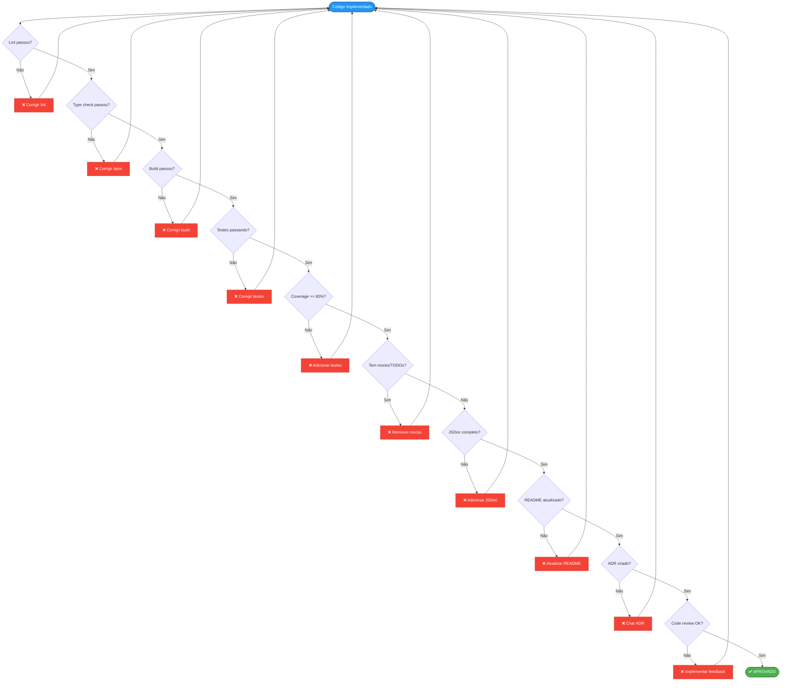

# FASE 0 - Infraestrutura e Fundação - Workflow

**Data de Criação**: 2025-10-15
**Responsável**: Agente-CTO + Agente-Dev
**Status**: 🟡 Em Progresso
**Conformidade**: Protocolo Agente-CTO v2.0

---

## 🎯 Objetivo da FASE 0

Estabelecer base técnica sólida antes de qualquer desenvolvimento de features, incluindo:
- Database Schema completo (Drizzle ORM)
- Autenticação e Multi-tenancy (Better-Auth)
- Estrutura modular (Elysia patterns)
- Sistema de migrations e seeds

---

## 📊 Workflow Principal - Mermaid

```mermaid
graph TD
    Start([Início FASE 0]) --> A1[0.1 Configuração do Ambiente]

    A1 --> A1_1{Docker disponível?}
    A1_1 -->|Sim| A1_2[Setup Docker Compose]
    A1_1 -->|Não| A1_3[Setup Local Services]
    A1_2 --> A1_4[Configurar TimescaleDB]
    A1_3 --> A1_4
    A1_4 --> A1_5[Configurar Redis]
    A1_5 --> A1_6[Configurar Ollama]
    A1_6 --> A1_7{Ambiente OK?}
    A1_7 -->|Não| A1_8[Troubleshooting]
    A1_8 --> A1_1
    A1_7 -->|Sim| B1[0.2 Database Schema]

    B1 --> B1_1[Criar estrutura de módulos]
    B1_1 --> B1_2[Definir schemas Drizzle]
    B1_2 --> B1_3{Todos os 15 módulos?}
    B1_3 -->|Não| B1_4[Criar schemas faltantes]
    B1_4 --> B1_2
    B1_3 -->|Sim| B1_5[Adicionar JSDoc]
    B1_5 --> B1_6[Validar tipos TypeScript]
    B1_6 --> B1_7{0 erros compilação?}
    B1_7 -->|Não| B1_8[Corrigir erros]
    B1_8 --> B1_6
    B1_7 -->|Sim| B1_9[Criar migrations]
    B1_9 --> B1_10[Testar migrations]
    B1_10 --> B1_11{Migrations OK?}
    B1_11 -->|Não| B1_12[Corrigir migrations]
    B1_12 --> B1_9
    B1_11 -->|Sim| C1[0.3 Autenticação]

    C1 --> C1_1[Configurar Better-Auth]
    C1_1 --> C1_2[Setup OAuth Google]
    C1_2 --> C1_3[Implementar RBAC]
    C1_3 --> C1_4[Criar roles base]
    C1_4 --> C1_5[Implementar middleware auth]
    C1_5 --> C1_6[Setup sessões Redis]
    C1_6 --> C1_7{Auth funcionando?}
    C1_7 -->|Não| C1_8[Debug auth]
    C1_8 --> C1_1
    C1_7 -->|Sim| D1[0.4 Multi-tenancy]

    D1 --> D1_1[Implementar tenant isolation]
    D1_1 --> D1_2[Criar middleware tenant]
    D1_2 --> D1_3[Testar 3 tipos tenant]
    D1_3 --> D1_4{Isolation OK?}
    D1_4 -->|Não| D1_5[Corrigir isolation]
    D1_5 --> D1_1
    D1_4 -->|Sim| E1[0.5 Seeds Sistema]

    E1 --> E1_1[Criar CEO user]
    E1_1 --> E1_2[Criar 9 departamentos]
    E1_2 --> E1_3[Criar roles sistema]
    E1_3 --> E1_4[Criar dados exemplo]
    E1_4 --> E1_5{Seeds executados?}
    E1_5 -->|Não| E1_6[Corrigir seeds]
    E1_6 --> E1_1
    E1_5 -->|Sim| F1[Validação FASE 0]

    F1 --> F1_1[Executar testes]
    F1_1 --> F1_2{Coverage >= 80%?}
    F1_2 -->|Não| F1_3[Criar testes faltantes]
    F1_3 --> F1_1
    F1_2 -->|Sim| F1_4[Executar lint]
    F1_4 --> F1_5{0 erros lint?}
    F1_5 -->|Não| F1_6[Corrigir lint]
    F1_6 --> F1_4
    F1_5 -->|Sim| F1_7[Type check]
    F1_7 --> F1_8{0 erros tipo?}
    F1_8 -->|Não| F1_9[Corrigir tipos]
    F1_9 --> F1_7
    F1_8 -->|Sim| F1_10[Build]
    F1_10 --> F1_11{Build OK?}
    F1_11 -->|Não| F1_12[Corrigir build]
    F1_12 --> F1_10
    F1_11 -->|Sim| G1[Code Review]

    G1 --> G1_1[Criar Pull Request]
    G1_1 --> G1_2[Revisão Agente-QA]
    G1_2 --> G1_3[Revisão Agente-CTO]
    G1_3 --> G1_4{Aprovado por 2+?}
    G1_4 -->|Não| G1_5[Implementar correções]
    G1_5 --> G1_1
    G1_4 -->|Sim| H1[Documentação]

    H1 --> H1_1[Gerar ADR]
    H1_1 --> H1_2[Atualizar README]
    H1_2 --> H1_3[Atualizar CHANGELOG]
    H1_3 --> H1_4[Gerar QA Report]
    H1_4 --> H1_5{Docs completa?}
    H1_5 -->|Não| H1_6[Completar docs]
    H1_6 --> H1_1
    H1_5 -->|Sim| End([FASE 0 Concluída ✅])

    style Start fill:#4CAF50,stroke:#2E7D32,color:#fff
    style End fill:#4CAF50,stroke:#2E7D32,color:#fff
    style A1_7 fill:#FFC107,stroke:#F57F17
    style B1_7 fill:#FFC107,stroke:#F57F17
    style B1_11 fill:#FFC107,stroke:#F57F17
    style C1_7 fill:#FFC107,stroke:#F57F17
    style D1_4 fill:#FFC107,stroke:#F57F17
    style E1_5 fill:#FFC107,stroke:#F57F17
    style F1_2 fill:#FFC107,stroke:#F57F17
    style F1_5 fill:#FFC107,stroke:#F57F17
    style F1_8 fill:#FFC107,stroke:#F57F17
    style F1_11 fill:#FFC107,stroke:#F57F17
    style G1_4 fill:#FFC107,stroke:#F57F17
    style H1_5 fill:#FFC107,stroke:#F57F17
```

---

## 🌳 Árvore de Decisão - Validação de Qualidade

---

## 📝 Subtarefas (Máximo 6 por Protocolo)

### **Subtarefa 1: Database Schema e Módulos**
- **Responsável**: Agente-Dev
- **Duração**: 3-4 dias
- **Status**: ✅ 95% Completo
- **Entregáveis**:
  - ✅ 15 módulos criados em `src/modules/`
  - ✅ Schemas Drizzle completos
  - ⏳ JSDoc em todos os schemas
  - ⏳ README por módulo

### **Subtarefa 2: Better-Auth + OAuth**
- **Responsável**: Agente-Dev
- **Duração**: 2-3 dias
- **Status**: ⏳ 0% - Pendente
- **Entregáveis**:
  - Better-Auth configurado
  - OAuth Google funcionando
  - Middleware de autenticação
  - Testes de auth (>80% coverage)

### **Subtarefa 3: RBAC e Multi-tenancy**
- **Responsável**: Agente-Dev
- **Duração**: 2-3 dias
- **Status**: ⏳ 0% - Pendente
- **Entregáveis**:
  - Sistema RBAC completo
  - Middleware tenant isolation
  - 3 tipos de tenant funcionando
  - Testes de isolation

### **Subtarefa 4: Migrations e Seeds**
- **Responsável**: Agente-Dev
- **Duração**: 1-2 dias
- **Status**: ⏳ 0% - Pendente
- **Entregáveis**:
  - Migrations Drizzle versionadas
  - Seeds para CEO + 9 departamentos
  - Script de reset database
  - Testes de migrations

### **Subtarefa 5: Testes e QA**
- **Responsável**: Agente-QA
- **Duração**: 2-3 dias
- **Status**: ⏳ 0% - Pendente
- **Entregáveis**:
  - Testes unitários (coverage >= 80%)
  - Testes de integração
  - QA Report versionado
  - CI/CD pipeline básico

### **Subtarefa 6: Documentação e ADR**
- **Responsável**: Agente-CTO
- **Duração**: 1 dia
- **Status**: 🟡 30% - Em Progresso
- **Entregáveis**:
  - ADRs para decisões técnicas
  - README por módulo
  - CHANGELOG atualizado
  - Diagramas Mermaid

---

## ✅ Checklist de Validação Final

Antes de aprovar FASE 0, TODOS os itens abaixo devem estar ✅:

### Qualidade de Código
- [ ] 0 erros de lint
- [ ] 0 warnings
- [ ] 0 erros de tipo (TypeScript)
- [ ] Build passando sem erros
- [ ] 0 mocks, placeholders ou TODOs no código

### Testes
- [ ] Testes unitários >= 80% coverage
- [ ] Testes de integração criados
- [ ] Todos os testes passando (100%)
- [ ] QA Report gerado e versionado

### Documentação
- [ ] JSDoc em todos os schemas
- [ ] README em cada módulo
- [ ] ADR para todas decisões técnicas
- [ ] CHANGELOG atualizado
- [ ] Diagramas Mermaid criados

### Code Review
- [ ] PR criado
- [ ] Aprovado por Agente-QA
- [ ] Aprovado por Agente-CTO
- [ ] Feedback implementado

### Funcionalidade
- [ ] Auth funcionando (login/logout/OAuth)
- [ ] RBAC implementado
- [ ] Multi-tenancy isolado
- [ ] Migrations executando
- [ ] Seeds populando banco
- [ ] Environment configurado

---

## 🎯 Métricas de Sucesso

| Métrica | Meta | Atual | Status |
|---------|------|-------|--------|
| Coverage de Testes | >= 80% | 0% | ❌ |
| Erros de Lint | 0 | 0 | ✅ |
| Erros TypeScript | 0 | 0 | ✅ |
| Warnings | 0 | 0 | ✅ |
| Schemas Completos | 15/15 | 15/15 | ✅ |
| JSDoc Coverage | 100% | 0% | ❌ |
| README por módulo | 15/15 | 0/15 | ❌ |
| ADRs Criados | >= 4 | 0 | ❌ |
| Code Reviews | >= 2 | 0 | ❌ |

---

## 📌 Notas Importantes

1. **Zero Tolerance**: Não avançar para FASE 1 sem 100% de conformidade
2. **Branch Strategy**: Criar `feature/fase-0-infrastructure` antes de mergear
3. **CI/CD**: Configurar GitHub Actions para validação automática
4. **Rollback Plan**: Documentar plano de reversão em caso de falhas

---

**Última Atualização**: 2025-10-15
**Próxima Revisão**: Após conclusão de cada subtarefa
**Aprovação Final**: Agente-CTO + CEO (Julio Cezar)
